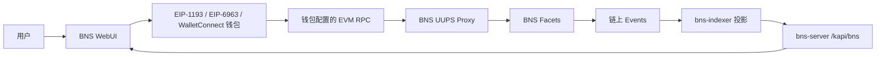
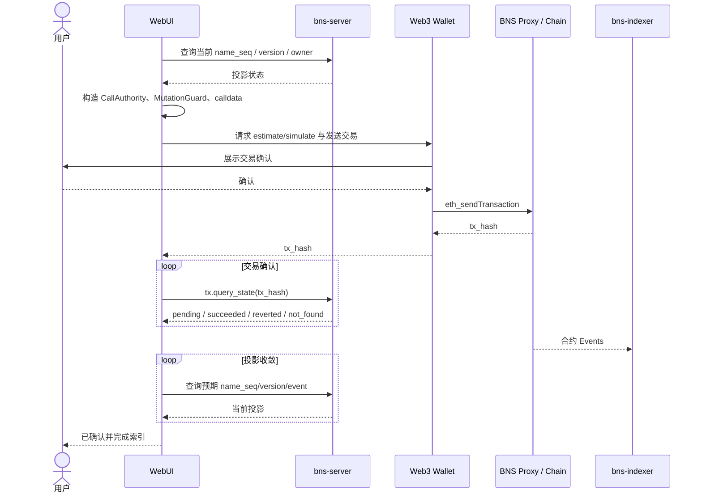
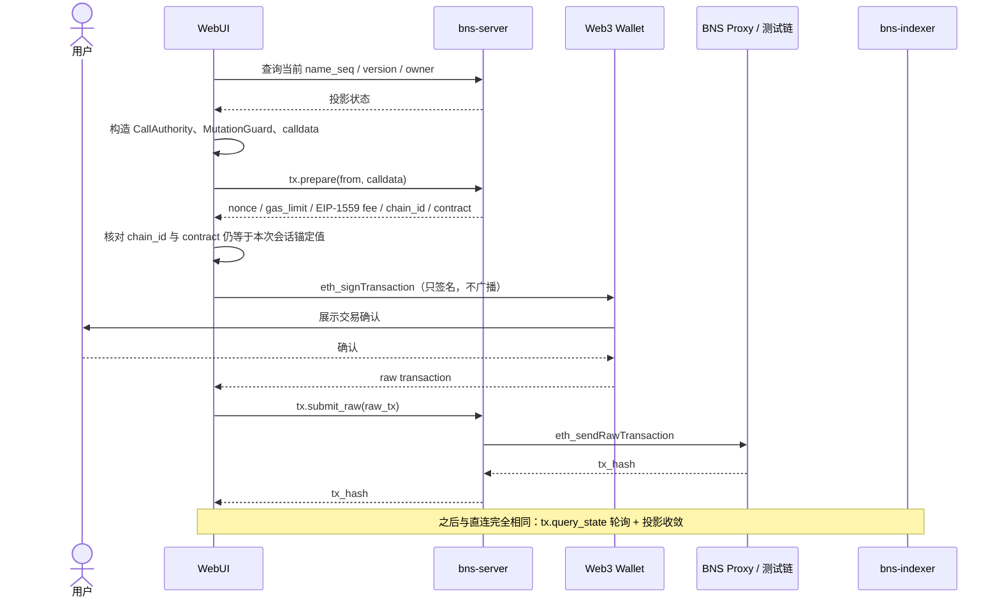

# BNS WebUI 产品需求文档（PRD）

- 产品名称：BNS WebUI
- 文档版本：v1.1
- 面向协议版本：Beta2.2
- 文档状态：Draft
- 日期：2026-07-31
- 需求原则：写操作由用户钱包直接调用 BNS Proxy 合约；状态查询统一调用 bns-server

修订记录：

- v1.1（2026-07-31）：依据产品语音需求，加入产品分层定位（2.1、G5）、账号与资产心智模型（5.1、第 7 节、9.3、9.6）、续期公共性定位（9.5）、安全中心与场景化引导（9.16、9.18、9.23）、代办注册与接管（9.24），以及使用权收据 / 经济模型 / 股权化等未来预留（16.4）。
- v1.0（2026-07-30）：首版，以仓库实际实现为准的实现映射。

---

## 1. 文档依据与结论

本 PRD 以当前仓库中的实际实现为准，而不是仅依据历史设计稿：

- 聚合合约接口：`src/apps/bns/src/IBns.sol`
- 合约类型与约束：`src/apps/bns/src/BnsTypes.sol`、`src/apps/bns/src/BnsCore.sol`
- 业务 Facet：`src/apps/bns/src/Bns*Facet.sol`
- BNS-Server 路由：`src/components/bns-server/src/lib.rs`
- RPC method 与 JSON 类型：`src/components/bns-client/src/rpc.rs`
- 投影数据模型：`src/components/bns-client/src/model.rs`
- Facet selector 清单：`src/apps/bns/hardhat-scripts/facet-manifest.json`

当前实现的核心结论如下：

1. BNS 业务合约对外只有一个 UUPS Proxy 地址。WebUI 不得向 Facet 地址发交易。
2. 合约当前路由 28 个业务 selector，其中 15 个会改变状态。
3. bns-server 当前实际暴露 13 个 kRPC method，而现有 `BNS-API.md` 中“11 个方法”的总览已落后于代码；新增的实际方法是 `system.info` 和 `tx.prepare`。
4. 普通 Web3 钱包写入不使用 `tx.submit_raw`，也不依赖 `tx.prepare`。钱包直接通过其 EVM Provider 向 Proxy 发送交易。仅当链节点对浏览器不可达（内网测试链）时，才由部署配置显式开启这两个方法组成的中继投递，属于测试路径，见 8.5。
5. 所有页面状态、名称状态、文档、authority、事件和交易状态均从 bns-server 查询，不以合约 view call 作为产品数据源。
6. 一笔写操作存在两个完成阶段：
   - 链上交易成功；
   - bns-indexer 完成投影、bns-server 查询结果可见。

v1.1 起，本 PRD 同时包含两类内容，阅读时须区分：

- **实现映射**：以仓库当前实现为准的接口、字段与流程约束（原有全部章节）；
- **产品心智层**：把既有能力翻译成一般用户可理解的账号 / 资产 / 安全概念（2.1、5.1、第 7 节、9.23、9.24），以及明确标注“未实现”的未来预留（16.4）。

心智层只改变信息的组织与默认曝光程度，不改变第 4 节的读写边界，也不允许用文案掩盖 6.4 的语义缺口；所有未实现的规划一律集中在 16.4，不与当前实现混写。

---

## 2. 背景

BNS 已具备名称注册、续期、所有权表达、authority key、controller policy、文档版本、DID alias、支付目标和事件日志等链上能力，但当前使用方式主要面向合约、Rust Client 和命令行调用。

BNS WebUI 的目标是为普通用户和高级用户提供一个钱包驱动的图形界面，使用户无需手工构造 ABI calldata，即可：

- 搜索和查看 BNS 名称、owner、文档及事件状态；
- 使用常见浏览器钱包或移动钱包直接签名 BNS 合约交易；
- 管理自己持有或有权控制的名称；
- 清晰理解交易确认、Indexer 同步和最终可查询状态之间的差异；
- 在高风险操作前看到权限、版本 guard 和不可逆影响。

### 2.1 产品定位：分层递进，不做“合约浏览器”

WebUI 的底线能力，是让合约的主要功能、数据和状态可查询、可操作。但它不应停留在开发辅助工具：传统合约浏览器技术味过强，本产品用分层递进的方式管理信息密度，让默认界面贴近一般用户的心理认知：

1. **第一层（默认）**：账号与资产。一级名称即账号（5.1），页面语言使用“账号 / 作品 / 买来的资产 / 安全”这类概念，不直接暴露合约术语；
2. **第二层（进阶）**：名称详情、文档版本、authority、controller、guard 等协议对象，供高级用户展开；
3. **第三层（原始）**：raw JSON、hash、bytes、事件与交易细节，延续“如实呈现”原则。

分层只改变默认曝光程度与信息组织：任何一层的数据来源、读写边界（第 4 节）与语义缺口披露（6.4）完全一致。

---

## 3. 产品目标与非目标

### 3.1 产品目标

#### G1：常见钱包可用

WebUI 使用标准钱包接口，不绑定单一钱包品牌：

- 浏览器注入钱包：EIP-1193；
- 多注入钱包发现：EIP-6963；
- 移动端及扫码连接：WalletConnect；
- 首批验收钱包：MetaMask、Rabby、OKX Wallet、Coinbase Wallet，以及兼容 WalletConnect 的 EVM 钱包。

钱包只负责账户授权、网络切换、交易确认和签名，WebUI 永不接触私钥或助记词。

#### G2：读写边界清晰

- 写：钱包直接调用 BNS Proxy 合约。
- 读：WebUI 调用 bns-server 的 `/kapi/bns`。
- 交易状态：调用 bns-server 的 `tx.query_state`。
- DID 标准解析展示：调用 bns-server 的 `/1.0/identifiers/{did}`。

#### G3：覆盖 BNS 核心业务

v1 覆盖：

- 名称搜索、注册、续期、转移、语义 owner、释放；
- 二级名称注册和 namespace policy；
- 文档发布、更新、历史版本查询、撤销；
- authority key 查询与更新；
- controller policy 替换；
- DID alias；
- payment target；
- 原子批量 mutation；
- 事件和交易追踪。

#### G4：避免“交易成功但页面没变化”的误判

UI 必须显式区分：

1. 等待钱包；
2. 已广播；
3. 链上 pending；
4. 链上 succeeded/reverted；
5. 链上成功、等待索引；
6. bns-server 投影已更新。

#### G5：贴近一般用户的心智分层

- 默认视图用账号 / 资产语言组织（5.1、9.3），协议对象收进进阶层；
- 吊销、永久禁用等高风险协议操作提供面向普通人的场景化引导入口（安全中心，9.23）；
- 代办注册的服务商关系以可理解方式呈现，并在条件满足时引导用户接管（9.24）；
- 任何一层都不伪造服务端不具备的数据，不掩盖 6.4 的缺口。

### 3.2 非目标

v1 不包含：

- 私钥托管、助记词导入、WebUI 自行签名；
- 在生产部署中通过 bns-server 的 `tx.submit_raw` 代理钱包交易（该中继仅作为内网测试链的测试路径，默认关闭且不进用户界面，见 8.5）；
- 合约升级、Facet 管理、Proxy ownership 等治理后台；
- NFT 市场能力；当前 BNS 不是 ERC-721，不能使用 `ownerOf`、`safeTransferFrom`；
- 法币、Token 定价或自动收款；当前注册与续期函数虽然是 `payable`，但合约没有消费或校验 `msg.value`（名称经济模型属未来预留，见 16.4）；
- 使用权购买、购买收据与“我的库”式消费体验；链上当前没有使用权收据机制（未来预留见 16.4）；
- 名称资产的部分股权化（基于名称发行 token；见 16.4）；
- 从 bns-server 不存在的接口伪造“完整 authority key 列表”“完整 controller rule 列表”或“完整文档类型列表”；
- 历史 `iat` DID 解析。当前 DID Resolver 对 `iat` 查询返回 501。

---

## 4. 产品原则与系统边界

### 4.1 总体架构



### 4.2 强制读写规则

| 行为 | 唯一产品数据路径 | 禁止路径 |
| --- | --- | --- |
| 查询名称、owner、文档、authority、事件 | WebUI → bns-server | WebUI 直接调用合约 view |
| 提交写交易 | WebUI → Wallet → EVM RPC → BNS Proxy | 生产部署走 `tx.submit_raw` |
| 查询交易状态 | WebUI → bns-server `tx.query_state` | 仅依赖钱包弹窗状态 |
| 查询 Indexer 后状态 | WebUI 轮询相关 bns-server 查询 | 看到 receipt 后立即假设页面状态已更新 |
| ABI 编码 | WebUI 本地使用聚合 ABI | 调用某个 Facet 地址 |

写交易存在一条例外路径：当链节点对浏览器不可达（典型为内网测试链）时，允许由部署配置
显式开启 `tx.prepare` + `tx.submit_raw` 的中继投递。它是**测试路径，不是产品写路径**，
默认关闭、不进用户界面，详见 8.5。生产部署一律走上表的直连路径。

钱包 RPC 的 `eth_estimateGas` 或交易模拟只用于待提交交易的准备和 revert 预检，不得把模拟
返回值作为页面业务状态源；页面展示的业务状态仍只来自 bns-server。

### 4.3 为什么保留两个 RPC 通道

- 钱包 Provider 是交易提交通道，交易由用户确认，`msg.sender` 为钱包地址。
- bns-server 是产品查询通道，返回 Indexer 的统一投影，并提供交易状态和系统配置。
- 两者可能连接到不同节点，因此 WebUI 必须通过 `system.info` 校验 chain ID 和 Proxy 地址，并对不一致状态进行阻断。

---

## 5. 用户与权限模型

### 5.1 账号与资产心智模型

这是 v1.1 起页面组织的第一原则，把协议对象翻译成一般用户可理解的概念。它是纯前端视图层约定，不引入新接口，也不改变授权模型。

#### 一级名称即账号

- 本体系的核心是名称的 owner：钱包地址下持有一个或多个一级名称，一级名称之下再挂一批二级名称；
- 对大多数用户，一级名称只有一个。产品把一级名称直接呈现为“账号”，用户无需理解“一级名称的整体管理”——他的理解就是：一级名称就是账号；
- 只有一个一级名称时，界面只显示该账号；有多个时，采用传统产品的“快速账号切换”交互（顶部账号切换器，见 7.1），当前账号决定默认展示哪一棵名称树；
- 账号切换是纯前端视图切换，不发起链上交易，不改变钱包连接与授权状态。

#### 资产按来源分三组

| 分组 | 定义 | 归属维度 | v1 状态 |
| --- | --- | --- | --- |
| 我的作品（我创建的资产） | 当前账号及其名下的二级名称、文档等，原则上是“我创建的东西” | 按账号（一级名称）归组 | v1 实现，分组规则见 9.3 |
| 我买来的资产 | 从他人处买入产权的名称（例：`book.bob` 原属 Bob，产权转移给我），投资性持有，类似“我是股东” | 按钱包地址归组，跨账号，不塞进任何一级名称之下 | v1 以“结构上不属于我的账号的持有名称”呈现；链上购买撮合机制未实现 |
| 我买过的使用权 | 付费获得他人资产的使用权，凭公开的购买收据表达（君子协议，不做强 DRM） | 按钱包地址 | 未实现，见 16.4；未来在本产品中只展示购买收据，消费体验属另一产品域 |

补充约定：

- “作品”一词待定，命名原则是“我创建的东西”；文案走 code + 参数机制，保留替换空间；
- 产权与使用权必须区分：买断产权后名称的 `asset_owner` 变为我；买使用权只产生一张公开收据，名称仍属原 owner。v1 链上只有产权转移（`transferName`）一种机制，UI 中任何“购买”动词都不得暗示存在链上撮合或支付；
- 大众化的使用权购买（类 Steam 的“库”）是独立的 C 端产品域，本 WebUI 不承载浏览与消费，未来只需要能看到购买收据。

### 5.2 用户角色

| 角色 | 是否需要钱包 | 主要能力 |
| --- | --- | --- |
| 访客 | 否 | 搜索名称、查看 owner、文档、事件和 DID 解析 |
| Asset Holder | 是 | 查看 `asset_owner` 为当前地址的名称；不等于一定拥有所有业务操作权限 |
| Effective Owner | 是 | 以 chain account 或 BNS name authority key 管理名称 |
| Controller | 是 | 按 controller rule 的 doc type、permission 和有效期执行有限操作 |
| 高级用户 | 是 | authority、policy、原子 batch、hash 和底层参数编辑 |
| 协议运维 | 是 | checkpoint/合约治理；不属于 v1 普通用户界面 |

### 5.3 Asset Owner 与 Effective Owner 必须分开显示

- `asset_owner`：名称资产记录中的 EVM 地址，也是 `name.query_by_addr` 的查询条件。
- `semantic_owner`：只允许 `unset` 或 `bns_name`，不允许直接设置 `chain_account`。
- `effective_owner`：
  - 顶级名称且 semantic owner 未设置：回退到 `asset_owner`；
  - 二级名称且 semantic owner 未设置：继承父名称 owner；
  - semantic owner 为 BNS name：使用该 BNS name 的 authority set。
- `owner_source`：`asset_owner_fallback`、`explicit_semantic_owner` 或 `parent_inherited`。

产品文案不得把“我的账号与资产”解释成“我能管理的全部名称”。`name.query_by_addr` 只能列出当前地址作为 `asset_owner` 的名称，不能列出通过 BNS authority key、controller rule 或父名称继承可控制的名称。

### 5.4 CallAuthority 自动构造

WebUI 根据用户选择的授权路径构造 `CallAuthority`，但最终身份始终由合约使用 `msg.sender` 校验。

| 场景 | role | actor | kid |
| --- | --- | --- | --- |
| 顶级名称公开注册 | `None` | `Unset` | zero bytes32 |
| Chain Account Owner | `Owner` | 当前钱包的 `ChainAccount` | zero bytes32 |
| BNS Name Owner | `Owner` | owner BNS name | 用户选择的 key kid |
| Chain Account Controller | `Controller` | controller 地址 | zero bytes32 |
| BNS Name Controller | `Controller` | controller BNS name | 用户选择的 key kid |

前端必须校验：

- `ChainAccount.value` 按 ABI 编码为 20 字节裸地址；
- `BnsName.value` 为名称的 UTF-8 bytes；
- BNS authority key 的 `key_data` 必须能还原为当前钱包 20 字节地址；
- key 必须为 `active`，包含 authentication bit，且位于有效时间窗内；
- 用户切换账户后，废弃尚未提交的 authority 计算和表单确认结果。

---

## 6. 当前实现约束

### 6.1 名称格式

合约当前实际限制：

- 只接受小写 ASCII 字母、数字、`-` 和 `.`；
- 总长度 1～253 bytes；
- 单 label 最长 126 bytes；
- label 不能以 `-` 开头或结尾；
- 合约最多允许一个 `.`，即只支持顶级名称和二级名称；
- 输入不得包含 `did:bns:` 前缀；
- 不自动 lower-case；WebUI 可以提供“转换为小写”按钮，但不得静默修改后直接提交。

### 6.2 文档格式

- `doc_type` 长度 1～32 bytes；
- 只接受小写 ASCII 字母、数字、`-` 和 `_`；
- inline 文档最大 4 KiB；
- inline 文档的 `uri` 必须为空；
- inline 文档的 `content_hash` 必须为 `sha256(inline_document)`；
- 非 inline 文档的 `inline_document` 必须为空；
- `registerName` 和 `applyMutations` 最多包含 32 个
  authority/document/owner-policy item；
- 上述两个方法中 inline 文档总量最多 64 KiB，doc type 不得重复；
- `transferName` 和 `updateAuthorityKeys` 当前没有同样的显式数量上限。WebUI 仍应使用 32 项
  产品上限，避免不可估算的 calldata 和 gas。

### 6.3 时间与数值

- 所有时间字段为 Unix seconds；
- `0` 在 `valid_until`、`expire_at` 等字段中通常表示不设截止时间；
- Rust `u64` 当前通过 JSON number 返回。WebUI 数据层必须先验证 `Number.isSafeInteger`；超过 JavaScript 安全整数范围时不得静默舍入；
- WebUI 表单内部优先使用 `bigint`，显示时再格式化。

### 6.4 当前合约语义缺口

以下是产品必须如实处理的现状：

1. 名称不会仅因当前时间超过 `expireAt` 自动把链上 `status` 改成 `Expired`；WebUI 应同时显示“原始状态”和基于时间计算的“有效期已过”标签。
2. `transferable` 当前只影响派生字段 `standard_transfer_enabled`，`transferName` 本身没有检查该 flag。
3. `allow_delegated_subnames` 当前没有参与 `registerName` 的链上鉴权；二级名称注册仍要求父名称 effective owner 授权。
4. `registerName` 和 `renewName` 是 `payable`，但当前没有价格校验、收款或退款逻辑。WebUI 必须固定发送 `value = 0`。
5. `ReleaseAfterGrace` 调用后立即写入 `Released`；当前重新注册逻辑允许 `Released` 名称再次注册，并不在合约中等待 `graceUntil`。
6. `publishLogCheckpoint` 当前没有把 `issuer` principal 与 `msg.sender` 做身份绑定，不应出现在普通用户入口。
7. bns-server 没有同步高度/链 tip/落后区块数接口，无法严格证明某次查询已追到最新链状态。
8. Released 名称重新注册时，当前 `_registerNameHash` 不会清理旧 authority key、文档版本、
   controller policy 或 alias 等关联存储。WebUI 不应在普通流程中开放 Released 名称重注册，
   直至协议明确 lineage 隔离和旧状态清理规则。
9. `RegisterOptions.initialPaymentTarget` 存在于 ABI，但当前注册逻辑没有读取或保存它。WebUI
   固定传 zero address，不展示为有效注册选项；初始文档的 payment target 不受此问题影响。
10. Controller rule 的 `namespaceScopeHash`、`constraintHash` 当前只存储、不参与授权判断；
    authority key 的 `verificationMethod` 也不参与 signer 验证。WebUI 必须把这些字段标为
    “承诺/元数据”，不能描述为已被合约强制执行。
11. Authority key 的 Recovery 和 Sign Document purpose 当前不会授予链上写权限；实际
    `msg.sender` 验证只检查 Authentication bit 和 20 字节地址 key data。

这些缺口不应由 WebUI 用文案掩盖。上线前如协议语义有调整，应先修改合约或 bns-server，再同步更新 PRD。

---

## 7. 信息架构

### 7.1 顶部全局区

- BNS 搜索框；
- 当前网络；
- bns-server 健康状态；
- Indexer 状态提示；
- 连接钱包按钮；
- 当前账户及切换/断开；
- 当前账号（一级名称）与快速切换器：仅持有一个一级名称时不显示切换器，多个时按 5.1 的账号切换交互；
- 交易中心入口。

### 7.2 一级导航

1. 首页
2. 搜索与解析
3. 我的账号（当前账号视图：账号信息与名下作品，见 9.3）
4. 我买来的资产（钱包维度的投资持有，见 9.3）
5. 注册名称
6. 安全中心（吊销与永久禁用的场景化引导，见 9.23）
7. 交易中心
8. 事件浏览器
9. 高级工具
10. 设置

### 7.3 名称详情页二级导航

1. 概览
2. 文档
3. Owner 与 Authority
4. Controller
5. Alias 与支付
6. Namespace
7. 活动记录
8. 危险操作（吊销与永久禁用等；安全中心从 9.23 引导进入本 tab 的具体流程）

---

## 8. 全局能力需求

### 8.1 启动与服务发现

页面启动后：

1. `GET /health`，确认 bns-server HTTP 可达；
2. 调用 `system.info`；
3. 读取 `ready`、`chain_id` 和 `contract_address`；
4. 校验 `contract_address` 为 20 字节地址；
5. 将该地址作为本次会话唯一 BNS Proxy 地址；
6. 若 `system.info` 失败，不允许提交写交易，但公共页面可显示明确的服务错误。

禁止仅依赖前端构建时写死的合约地址。允许提供“期望 chain ID/contract”部署配置，并与 `system.info` 返回值进行二次比对；不一致时进入只读故障态。

### 8.2 钱包连接

钱包选择器应：

- 使用 EIP-6963 展示多个已安装注入钱包；
- 对仅提供传统 `window.ethereum` 的钱包保留兼容入口；
- 提供 WalletConnect 扫码和移动端 deeplink；
- 不在用户点击前请求账户权限；
- 监听 `accountsChanged`、`chainChanged`、`connect`、`disconnect`；
- 账户或网络变化后重新计算页面权限；
- 不把 provider 名称或自报 `rdns` 当作安全身份。

### 8.3 网络校验

连接钱包后比较：

- 钱包 `eth_chainId`；
- bns-server `system.info.chain_id`。

状态：

| 状态 | UI |
| --- | --- |
| 一致 | 允许写操作 |
| 不一致、钱包支持切换 | 显示“切换网络” |
| 不一致、未知网络 | 允许使用部署配置执行 `wallet_addEthereumChain` |
| 用户拒绝切换 | 保持只读 |
| `system.info` 与前端期望配置不一致 | 阻断全部写操作 |

### 8.4 权限预检

进入写表单前读取：

- `name.query_state`；
- `name.resolve_owner`；
- 必要时 `authority.get_set`、`authority.get_key`；
- 文档操作还需 `document.resolve`。

WebUI 只做可解释的预检。合约是最终授权方，前端不能把预检通过描述为“交易一定成功”。

### 8.5 写交易通用流程

一笔写交易需要三样东西：**calldata**、**签名**、**能把交易送进链节点的通道**。
前两样没有分歧——calldata 由 WebUI 生成，签名只能由用户钱包完成；
分歧只在第三样，因此存在两条投递路径。

#### 8.5.1 两条投递路径

| 模式 | 广播方 | 定位 | 启用方式 |
| --- | --- | --- | --- |
| `wallet_direct` 直连 | 钱包自己配置的 EVM RPC | **产品写路径**，默认 | 默认 |
| `server_relay` 中继 | bns-server 的 `eth_sendRawTransaction` | **测试路径**，不是产品写路径 | 部署配置显式开启 |

中继模式要解决的唯一问题是：**测试链/私链没有浏览器可达的 RPC**。
anvil 常常只跑在开发机或 VM 内网，bns-server 连得上、浏览器连不上，
此时钱包即使添加了自定义网络也广播不出去。`tx.prepare` 的存在就是为此——
它替代了“客户端自己查 nonce/gas/fee”，使 WebUI 在完全没有链 RPC 时也能构造交易。

**中继模式不是通用回退**，有一条硬约束：

> 中继需要一份**已签名的 raw transaction**，而取得它只能靠 `eth_signTransaction`。
> 主流注入式钱包（MetaMask 等）**不实现该方法**，只提供 `eth_sendTransaction`。

因此中继仅在以下场景可用：支持 `eth_signTransaction` 的钱包（Frame、部分硬件签名器、
部分 WalletConnect 对端）、浏览器之外的外部签名方、e2e 与开发工具。
WebUI 必须在**进入写表单阶段**就探测钱包能力并给出可解释的拒绝与替代方案，
不得等到用户点击提交才失败。

**路径选择优先级：直连 > `wallet_addEthereumChain` 后直连 > 中继。**
只要链节点对浏览器可达（网络可达且 CORS 允许），就应按 8.3 引导用户添加网络后走直连。

投递模式属于**部署配置**，不进用户界面，不允许终端用户在页面上切换。

#### 8.5.2 直连流程（产品路径）



#### 8.5.3 中继流程（测试路径）



中继模式的额外约束：

- `tx.prepare` 会重新读一次 `system.info`。若返回的 `chain_id` 或 `contract_address`
  与本次会话锚定值不一致，说明服务端在会话期间被切换到了另一条链或另一份合约，
  **必须中止**，不得照签。
- `nonce` 来自 `eth_getTransactionCount(from, "pending")`，已包含 mempool 中未打包的交易。
- 签名后的 raw transaction 会经过页面并交给 bns-server。签名不可篡改，
  但 bns-server 具备**丢弃或延迟**该交易的能力；这也是中继只作为测试路径的原因之一。

#### 8.5.4 两条路径的共同要求

1. ABI 编码目标必须是 `system.info.contract_address`。
2. 普通交易 `value` 固定为 0。
3. 钱包确认前必须向用户展示：方法名、Proxy 地址、chain ID、value、关键参数，
   以及**本次交易由谁广播**（钱包自身 RPC / bns-server 中继）。
4. 拿到 `tx_hash` 后立即写入本地交易中心。
5. 使用 `tx.query_state` 轮询交易：
   - 前 30 秒每 2 秒；
   - 30 秒～5 分钟每 5 秒；
   - 之后降为每 15 秒并允许用户停止。
6. `succeeded` 后继续轮询业务查询，直至目标字段达到预期值。
7. 5 分钟内未投影成功时显示“链上已成功，Indexer 尚未同步”，不得显示失败。
8. `reverted` 时显示失败；当前 `tx.query_state` 不提供 revert reason，优先展示提交前
   模拟错误，否则提示用户查看区块浏览器或 RPC 调试信息。
9. `not_found` 不是确定失败。它可能表示节点未见过、mempool 丢弃、同 nonce 替换或历史裁剪。
10. 不提供交易加速 / 取消 / 替换入口。交易的高级操作由钱包负责，WebUI 只做引导；
    因此也不维护 nonce 与 replacement 关系。

#### 8.5.5 两条路径的差异

| 环节 | 直连 | 中继 |
| --- | --- | --- |
| gas 估算 | 钱包 `eth_estimateGas` | `tx.prepare` 的 `estimated_gas` / `gas_limit` |
| 提交前 revert 模拟与 custom error 解码 | 支持时可做 | **不可用**（`eth_call` 同样需要链连接），UI 需明确说明 |
| 最终 gas/fee 决定方 | 钱包与用户；WebUI 不得静默覆盖 | `tx.prepare`；必须在确认页如实告知用户 |
| 钱包 RPC 依赖 | 必须有该 chainId 的可用 RPC | 不需要 |
| 钱包能力要求 | `eth_sendTransaction` | `eth_signTransaction`（多数钱包不支持） |

### 8.6 MutationGuard

所有带 guard 的写操作必须在最终弹出钱包前，从 bns-server 重新读取一次状态：

- 普通名称 mutation：`expectedNameSeq = name_state.name_seq`；
- 二级名称注册：`expectedParentNameSeq = parent.name_seq`；
- 文档写入：`expectedVersion = 当前文档版本`，从未发布时为 0。

如果交易因 stale guard revert：

- 不自动重放；
- 重新读取 bns-server；
- 显示旧值与新值；
- 让用户重新确认生成的新交易。

由于 bns-server 投影可能落后，重新读取仍不能从协议上保证 guard 是链 tip。该风险需在同步状态接口补齐前保留明确提示。

---

## 9. 页面与功能需求

### 9.1 首页

#### 目标

让访客快速搜索名称，让已连接用户快速进入持有名称和未完成交易。

#### 内容

- 全局名称/DID 搜索；
- 钱包连接卡片；
- 服务状态：HTTP、`system.info.ready`、chain ID、Proxy 地址；
- 当前账号（一级名称）卡片、名下资产数量及前 5 项；多账号时展示切换入口；
- pending、confirmed-but-indexing、failed 交易数量；
- 最新事件；
- 常用入口：注册名称、发布文档、查看 DID。

#### 数据

- `system.info`
- `name.query_by_addr`
- `events.list`
- 本地交易记录 + `tx.query_state`

#### 验收

- 未连接钱包时仍可搜索和查看公共数据；
- 服务不可用时不出现空白页；
- Proxy 地址可复制，并明确标记为“合约 Proxy”。

---

### 9.2 搜索与名称解析

#### 输入

支持：

- `alice`
- `device.alice`
- `did:bns:alice`
- EVM 地址
- 交易 hash

路由规则：

| 输入 | 行为 |
| --- | --- |
| BNS name | `name.query_state` |
| `did:bns:*` | 去掉前缀后查名称，并提供 DID Resolver 结果 |
| EVM 地址 | `name.query_by_addr` |
| 32 字节 hash | `tx.query_state` |

#### 名称不存在

`name.query_state` 返回 `null` 时：

- 显示“名称未在当前投影中找到”；
- 如果名称格式满足合约规则，显示“去注册”；
- 同时提示 Indexer 可能尚未同步，尤其是在用户刚提交注册后。

#### 名称详情摘要

- raw status；
- 基于 `expire_at` 计算的有效期标签；
- asset owner；
- semantic owner；
- effective owner 及来源；
- `name_seq`、`lineage_epoch`；
- 注册、过期、grace 时间；
- renewable、transferable、standard transfer enabled；
- namespace/payment/alias hash；
- owner document version。

---

### 9.3 我的账号与资产

本页承载 5.1 的账号 / 资产心智。数据仍然只来自 `name.query_by_addr`（按 `asset_owner` 查询），在其结果上做纯前端分组，不引入新接口。

#### 数据来源

调用：

```json
{
  "method": "name.query_by_addr",
  "params": {
    "address": "当前钱包地址",
    "cursor": null,
    "limit": 50
  }
}
```

使用 `next_cursor` 翻页。

#### 前端分组规则

对返回名称做确定性结构分组：

1. **账号**：顶级名称。恰好一个时直接作为当前账号；多个时全部进入顶部账号切换器（含买入的顶级名称——账号本身就是可交易资产）；
2. **当前账号的作品**：二级名称 `{label}.{parent}`，且 `parent` 属于我的顶级名称集合，归入对应账号视图，随账号切换过滤；
3. **我买来的资产**：二级名称的 `parent` 不属于我的任何顶级名称（典型如受让的 `book.bob`），归入钱包维度的独立列表，不随账号切换过滤。

分组按名称结构推导，不追溯取得方式（例如买入的 `x.alice` 若 `alice` 是我的账号，仍归入作品组）；精确来源需要事件回扫，v1 不做。每一项都是普通名称，点击进入统一的名称详情页。

受让二级名称的控制权提示：`parent` 不属于我时，若该名称 semantic owner 保持 Unset，effective owner 按 5.3 规则仍继承原父名称 owner——这类条目必须显示“仅持有、控制权仍在父名称 owner”状态。正确做法是在转移交易中一并设置 semantic owner（见 9.6）；事后补设需要现任 effective owner（即原父名称 owner）配合执行 9.7。

#### 列表字段

- 名称；
- raw status；
- asset owner；
- effective owner；
- 到期时间；
- name seq；
- 当前账户是否通过 owner 预检；
- pending 交易。

#### 限制提示

账号视图标题使用“我的账号”，资产列表副标题说明按 `asset_owner` 查询。该查询不能列出通过 authority、controller 或父名称继承可管理、但不由当前地址持有的名称（见 5.3），也不能列出名下 `asset_owner` 已设置为其他地址的二级名称。另提供搜索入口进入这些名称。

---

### 9.4 注册名称

对应合约：

```solidity
registerName(...)
```

#### P0 简单模式

字段：

- name；
- asset owner，默认当前钱包（可指定他人地址；代办注册场景见 9.24）；
- duration；
- grace period；
- renewable；
- transferable；
- allow delegated subnames。

默认：

- initial semantic owner：Unset；
- semantic owner after authority：Unset；
- authority updates：空；
- controller policy：空；
- initial documents：空；
- policy hash：zero；
- 顶级名称 authority role：None；
- `value = 0`。

#### P1 高级模式

支持在一笔注册交易中设置：

- authority key updates；
- semantic owner after authority；
- controller rules；
- controller policy hash；
- initial documents；
- initial payment/namespace policy hash。

`RegisterOptions.initialPaymentTarget` 当前被合约忽略，UI 固定编码 zero address。需要初始支付
目标时，应通过同一注册调用的 `initialDocuments[].paymentTarget` 设置。

#### 顶级名称

- `CallAuthority.role = None`；
- 合约不使用 `expectedNameSeq`；
- 名称在当前投影为 `null` 或 `Released` 时，合约才可能接受注册；
- WebUI 不把 `Expired` 显示为可抢注，因为当前合约会拒绝已存在的 `Expired` 状态。
- v1 普通流程只允许投影结果为 `null` 的新名称；Released 名称虽可被当前合约重新注册，
  但旧 authority/document/policy/alias 状态不会被注册逻辑完整清理，因此暂时阻断并提示协议风险。

#### 二级名称

- 名称格式为 `{label}.{parent}`；
- 查询 parent state 和 owner；
- 使用父名称授权；
- `guard.expectedParentNameSeq = parent.name_seq`；
- 当前合约要求父名称 raw status 为 `Active`；
- 当前合约未使用 `allow_delegated_subnames` 决定授权，UI 必须明确“仍需父名称 owner 签名”。

#### Self-managed BNS owner

若新名称希望使用自身 BNS authority：

1. `options.initialSemanticOwner` 保持 Unset；
2. 同一注册调用中创建至少一个有效 authentication key；
3. `semanticOwnerAfterAuthority` 设置为新名称本身。

直接把尚未存在或没有 active authority set 的 BNS name 放进 `initialSemanticOwner` 会 revert。

#### 成功收敛条件

- `tx.query_state.state == succeeded`；
- `name.query_state(name)` 非空；
- `lineage_epoch` 和 `name_seq` 与本次注册预期一致；
- 可选 initial document 均可通过 `document.resolve` 查询。

---

### 9.5 名称续期

对应合约：

```solidity
renewName(name, duration)
```

#### 产品定位：续期是公共维护行为

任何地址都可以为任何名称续期，这是设计意图而非鉴权缺口：续期注入的价值只会变成名称的有效时间，是一次性、不可退回的公共行为，与调用者是否使用该名称无关。考虑到公共名称的特点，体系明确允许任何人为名称注入维护费用。

因此除“我的账号与资产”外，任意名称详情页都提供“为它续期”入口（给别人续费），满足下列要求即可发起。当前合约续期只消耗 gas（`value = 0`，duration 为显式参数）；未来经济模型接入后，续期金额将按当时价格即时换算为有效期（见 16.4），本入口的交互框架保持不变。

要求：

- duration > 0；
- `renewable == true`；
- raw status 不是 `Released` 或 `Tombstoned`；
- 该函数当前不要求 owner/controller authority，任何钱包均可为名称续期；
- `value = 0`。

UI 必须在确认页显示：

- 当前 expire time；
- 新 expire time 的估算；
- grace delta；
- “任何账户都可代续期，续期只增加有效期、不可撤回”的说明；
- 调用者不是名称持有人时，明确显示“正在为他人名称续期”。

成功收敛条件：`expire_at` 增加且 `name_seq` 增加。

---

### 9.6 转移名称

对应合约：

```solidity
transferName(...)
```

字段：

- new asset owner；
- new semantic owner：只允许 Unset 或 BNS Name；
- 可选 atomic document updates。

要求：

- 当前用户通过 effective owner 鉴权；
- guard 使用当前 `name_seq`；
- new asset owner 非 zero address；
- 若 new semantic owner 是 BNS Name，该名称必须 Active 且有 active authentication key；
- atomic documents 使用各自 expected version。

产品提示：

- 这是 BNS 自定义转移，不是 ERC-721 transfer；
- Unset 对顶级名称表示回退到新 asset owner，对二级名称表示继承父 owner；
- 当前 `transferName` 不检查 `transferable` flag，UI 展示该事实，不以它作为错误的安全承诺；
- 交易会同时改变 asset owner 和 semantic owner，需展示 before/after 对比；
- 跨账号转移二级名称（parent 不属于受让方）时，semantic owner 传 Unset 意味着受让方只得到持有权、控制权仍随父名称 owner（5.3 继承规则）。确认页必须显式提示，并默认引导设置为受让方的 BNS name（目标名称须 Active 且有 active authentication key）。

高风险确认：

- 输入目标地址后显示 checksum 地址；
- 要求二次确认；
- 如果目标是当前地址，给出冗余操作提示；
- 不允许把 ChainAccount 作为 semantic owner 编码。

---

### 9.7 Semantic Owner 管理

对应合约：

```solidity
setNameOwner(...)
```

交互提供两个选项：

1. 使用默认 Owner：
   - 顶级名称回退到 asset owner；
   - 二级名称继承 parent effective owner。
2. 使用 BNS Name：
   - 输入目标名称；
   - 查询目标 authority set；
   - 只有 active key count > 0 时允许继续。

必须由当前 effective owner 授权，guard 使用当前 `name_seq`。

成功收敛条件：

- `semantic_owner` 更新；
- `effective_owner` 和 `owner_source` 符合新关系；
- `name_seq` 增加。

---

### 9.8 Namespace 管理

对应合约：

```solidity
setNamespacePolicy(...)
```

字段：

- allow delegated subnames；
- namespace policy hash。

允许 effective owner 或拥有 `PERMISSION_SET_NAMESPACE` 的 controller 提交。

当前限制：

- flag 会被保存和查询；
- 当前 `registerName` 未使用该 flag 做二级名称鉴权；
- UI 不得将开关文案写成“开启后第三方即可注册子名称”。

成功收敛条件：`allow_delegated_subnames`、`namespace_policy_hash` 和 `name_seq` 更新。

---

### 9.9 文档列表与详情

#### 已知文档入口

bns-server 没有“列出一个名称的全部 doc type”接口。v1 使用以下组合：

1. 内置常用 doc type：`owner`、`zone`、`boot`、`device`、`relay`、`payment`；
2. 用户手工输入 doc type；
3. 从当前会话和本地历史记录恢复；
4. 从 `events.list` 中识别 `document_published`/`document_revoked` 事件作为辅助；
5. 不宣称该列表完整。

#### 当前文档

调用 `document.resolve`，展示：

- doc type、version、previous version；
- raw document status；
- 基于 `expire_at` 的过期提示；
- storage type、URI、inline document；
- content/schema/codec/extra hash；
- controller、effective controller；
- beneficiary、payment target；
- controller/payment/split/price/rights policy hash；
- document state hash；
- alias kind/target；
- proof root。

inline 文档：

- 尝试按 UTF-8 显示；
- JSON 可格式化；
- JWT 按字符串显示；
- 二进制提供 hex/下载；
- 始终提供原始 bytes 视图。

#### 历史版本

用户输入或选择 version，调用 `document.get_version`。

由于没有“版本列表”接口：

- 当前 version 已知时，可按 `1..currentVersion` 懒加载；
- 不一次性并发加载全部版本；
- 版本不存在时显示空结果。

---

### 9.10 发布或更新文档

对应合约：

```solidity
publishDocument(...)
```

表单分为基础和高级模式。

#### 基础字段

- name；
- doc type；
- storage：
  - Inline；
  - URI；
- 文档内容或 URI；
- expire time；
- controller；
- beneficiary；
- payment target。

#### 自动生成

- `expectedVersion`：来自 `document.resolve`，不存在时为 0；
- inline `contentHash`：浏览器使用 SHA-256 计算；
- `storageType`：人类可读 label 转 bytes32；
- Inline 必须编码为 zero-padded bytes32 `"inline"`；
- 未设置 hash 字段使用 zero bytes32；
- 未设置 principal 使用 Unset。

#### 高级字段

- schema；
- codec；
- extra hash；
- controller policy hash；
- payment policy hash；
- split policy hash；
- price policy hash；
- rights policy hash；
- owner/controller authority 路径。

#### 权限

- Owner 可发布所有 doc type；
- Controller 必须匹配 rule 的 doc type、`PERMISSION_PUBLISH_DOCUMENT`、有效期和 signer；
- 发布 `owner` 文档或通过 `applyMutations` 包含 owner 文档时按 owner-only 处理。

#### 验收

- 4096 bytes inline 文档可提交；
- 4097 bytes 在请求钱包前阻断；
- expected version 冲突不自动覆盖；
- 成功后 `document.resolve.version` 增加；
- content hash 与输入重新计算结果一致。

---

### 9.11 撤销文档

对应合约：

```solidity
revokeDocument(...)
```

字段：

- name；
- doc type；
- expected version；
- reason hash；
- authority。

行为：

- 不是删除历史版本；
- 创建一个新的 `Revoked` 版本；
- payment target 和各 policy hash 在新 revoked 版本中清零；
- owner 文档撤销后 `owner_document_version` 指向新 revoked 版本。

危险确认页必须显示当前版本、将生成的新版本和 reason hash。

---

### 9.12 Authority 管理

#### 查询

- `authority.get_set`：显示 seq、root、active key count；
- `authority.get_key`：按用户输入的 kid 查询单个 key。

#### 当前接口限制

bns-server 不提供 key 列表，因此 WebUI 无法保证展示全部 key。页面必须显示：

> 当前服务仅支持按 kid 查询。下方列表由本地记录、用户输入和已知 key 组成，可能不完整。

#### 更新

对应合约：

```solidity
updateAuthorityKeys(...)
```

支持一笔交易中增加、更新或撤销多个 key。

字段：

- kid：bytes32；
- verification method：bytes32；
- key data；
- purposes；
- valid from/until；
- status；
- metadata hash；
- active。

辅助交互：

- “使用当前钱包作为 authentication key”：
  - key data 自动编码为当前钱包 20 字节地址；
  - purposes 勾选 Authentication；
- 人类可读 key label 可选择通过 `keccak256(UTF-8(label))` 计算 kid，但 UI 必须明确展示该
  计算规则和最终 bytes32，不得把 label 本身当作链上 kid；
- purposes 复选框：
  - Authentication = 1；
  - Recovery = 2；
  - Sign Document = 4。

安全约束：

- kid 和 verification method 不得为 zero；
- 若某 BNS name 被其他名称作为 authority owner，不能撤销它的最后一个 active authentication key；
- WebUI 无法仅凭 `active_key_count` 知道所有 key 的详情，批量替换前必须要求用户确认；
- 更新后用 `authority.get_set` 验证 seq/root/count，已知 kid 再逐个查询。

---

### 9.13 Controller Policy

对应合约：

```solidity
setControllerPolicy(...)
```

每条 rule 字段：

- controller principal；
- doc type，空字符串表示 wildcard；
- permissions bitmask；
- namespace scope hash；
- valid from/until；
- constraint hash。

`namespace scope hash` 和 `constraint hash` 当前仅作为链上元数据保存，合约授权逻辑尚未执行
这两个约束。UI 必须在字段旁显示该限制。

Controller principal 可以是 Chain Account 或 BNS Name。若为 BNS Name，设置 policy 前目标名称
必须 Active 且具有 active authentication key。

permissions：

| 权限 | bit |
| --- | ---: |
| Publish Document | 1 |
| Revoke Document | 2 |
| Set Payment | 4 |
| Set Alias | 8 |
| Set Namespace | 16 |

#### 关键限制

合约将 policy rules 存储在链上，但 bns-server 当前没有 `controller.get_policy` 查询接口；事件也只包含 `policy_hash`，不包含完整 rules。

因此 v1 采用“全量替换”高级表单：

- 不把当前 rules 显示为可完整读取；
- 用户必须导入或重新填写完整规则；
- 提交前明确提示“本次调用会替换全部现有规则”；
- 允许导出本地 JSON；
- 当前合约不计算或验证 policy hash。UI 只能使用明确版本化的 canonical JSON + hash 规则，
  或要求高级用户直接提供 bytes32；提交前必须展示最终值；
- 默认不在 P0 新手流程中展示。

要获得安全的常规管理体验，建议上线前增加 bns-server controller policy 查询接口。

---

### 9.14 DID Alias

对应合约：

```solidity
setDidAlias(...)
```

字段：

- target DID；
- kind：None / Alias / MigratedTo / Canonical；
- proof hash；
- authority。

约束：

- kind 非 None 时 target 必须以 `did:` 开头且长度大于 4；
- Owner 或拥有 `PERMISSION_SET_ALIAS` 的 Controller 可设置；
- guard 使用当前 `name_seq`。

读取现状：

- bns-server 没有独立 `alias.get`；
- `document.resolve` 会在文档存在时返回 alias kind/target；
- 没有文档时不能通过该接口取得完整 alias；
- 可从 `events.list` 辅助发现，但全局事件分页不保证高效。

UI 必须把 alias 状态标记为“基于当前可查询文档/事件得到”，不得声称始终完整。

---

### 9.15 Payment Target

对应合约：

```solidity
setPaymentTarget(...)
```

字段：

- name；
- doc type；
- expected version；
- payment target；
- beneficiary；
- payment/split/price/rights policy hash；
- authority。

要求：

- 当前文档必须存在；
- 调用不会创建新版本，返回并保留当前 version；
- 更新 document state hash；
- 增加 name seq；
- Owner 或拥有 `PERMISSION_SET_PAYMENT` 的 Controller 可调用。

读取通过 `document.resolve` 的 document state 完成。

成功收敛条件：

- version 不变；
- payment target、beneficiary、policy hashes 更新；
- document state hash 和 name seq 更新。

---

### 9.16 吊销历史签发（Owner IAT Floor）

对应合约：

```solidity
setMinDocumentIat(...)
```

#### 用户场景（安全中心“吊销”入口，见 9.23）

体系内大量二级名称不上链：例如设备名称 `laptop.alice`，由 owner 私钥离线签发 device document，经 RTCP 协议与区块网络 reserve 使用。设备丢失或私钥疑似泄露后：

- 攻击者可以继续持有旧签发的文档与设备密钥，冒充 `laptop.alice` 行事；
- owner 并不知道泄露私钥签发过的完整文档列表（这些文档默认不上链），无法逐个精确吊销；
- owner 通常仍想继续使用这些名称，只希望“某个时间点之前签发的全部失效”。

合约为此提供的通用入口就是本操作：吊销以 IAT（签发时间）为阈值——设备丢了用户说不出文档版本号，但说得出大概什么时候丢的，这也是用 IAT 取代早期版本号方案的原因。用户选定一个时间后，该名称 owner 签发的、`iat` 早于该时间的链下文档（含未上链的二级名称 / 设备文档）一律视为无效；第三方校验方收到来自旧私钥的身份请求时，会在链上查询该阈值，把落在阈值之前的 document 判为无效。吊销后 owner 用当前私钥重新签发仍需要的文档即可恢复使用。

体系对 device 本身的能力另有独立限制，合约层的这个入口是通用兜底。合约调用本身很简单，本操作的产品复杂度全部在引导上：安全中心必须讲清什么情况该吊销（设备丢失、私钥疑似泄露）、影响范围（该 owner 签发的链下文档批量失效）、吊销之后要做什么（重新签发）。

字段：

- new minimum document iat；
- reason hash。

要求：

- 仅 Owner；
- 新值只能增加，不能回退；
- guard 使用当前 name seq。

确认页显示：

- current value；
- new value；
- 受影响的 owner document 验证语义；
- 不可回退警告。

成功收敛条件：`min_document_iat`、`owner_policy_seq`、`name_seq` 增加。

---

### 9.17 原子批量 Mutation

对应合约：

```solidity
applyMutations(...)
```

用于在一笔交易中原子执行：

- authority key updates；
- 多个 document updates；
- owner min document iat update。

规则：

- 至少包含一项 mutation；
- item 总数最多 32；
- inline bytes 总数最多 64 KiB；
- doc type 不得重复；
- 包含 authority update、owner policy 或 `owner` 文档时整笔交易为 Owner-only；
- 仅包含普通文档时可以按每个文档逐项验证 Controller 权限；
- 所有 expected version 和 name guard 必须来自同一轮最终预检。

UI：

- 仅高级模式开放；
- 显示原子性说明：任一项失败则全部回滚；
- 在确认页逐项展示 diff；
- 预估 calldata 大小和 gas；
- 支持导入/导出 JSON 草稿。

---

### 9.18 释放与永久 Tombstone

对应合约：

```solidity
releaseName(...)
```

模式：

- `ReleaseAfterGrace`
- `TombstoneForever`

当前真实行为：

- 两种模式都会立即离开 Active；
- `ReleaseAfterGrace` 实际写入 Released，当前合约允许 Released 名称重新注册，没有强制等待 grace；
- Released 名称重新注册可能继承旧 authority/document/policy/alias 存储，v1 普通注册流程暂时阻断；
- Tombstoned 名称不能重新注册；
- Tombstone 是不可逆的协议级危险操作。

#### 用户场景（安全中心“永久禁用”入口，见 9.23）

`TombstoneForever` 在产品层呈现为“永久禁用（ban）”，引导文案覆盖两类典型动机：

- **被盗用后的信用止损**：名称（常见是二级名称）被盗用并产生大量不良行为后，彻底禁用它往往是对信用负责的选择——代价是包括 owner 自己在内，谁都不能再使用它；
- **实体消亡**：公司等主体不再存续、名称在法律上无人继承时，可以把一级名称也 ban 掉，宣告它成为 dead name，此后不再有任何活动。

引导必须强调禁用对所有人生效、包括 owner 本人，这是与信用绑定的一次性决定，必须谨慎。

未来经济模型（见 16.4）接入后，有持有成本的名称 ban 即持有：禁用期间维护费用不可少，需一次性预付（例如 ban 三年就要一次交足三年费用）。v1 合约没有该约束，确认页文案不得做出与之矛盾的承诺。

交互：

- 放在“危险操作”；
- 默认折叠；
- 显示名称、asset owner、effective owner；
- 要求输入完整名称确认；
- Tombstone 额外勾选“我理解该名称无法重新注册”；
- reason 文本只作为本地辅助；当前合约不规定文本到 hash 的算法，UI 必须使用明确版本化的
  hash 规则或要求用户直接提供 bytes32，并展示最终 reason hash；
- 禁止自动重试。

---

### 9.19 交易中心

#### 本地记录

保存：

- tx hash；
- chain ID；
- Proxy 地址；
- wallet address；
- operation；
- name/doc type；
- submitted at；
- calldata 摘要；
- guard/version 快照；
- 预期投影条件；
- replacement hash，可选；
- 当前阶段。

不得保存私钥、签名原文或 WalletConnect 会话密钥。

#### 状态

- Awaiting Wallet
- Rejected by User
- Submitted
- Pending
- Succeeded / Indexing
- Completed
- Reverted
- Not Found
- Replaced/Unknown

#### 数据

使用 `tx.query_state`。页面重开后对未终态交易恢复轮询。

#### 操作

- 复制 tx hash；
- 打开配置的区块浏览器；
- 重新查询；
- 对 indexing 状态跳转业务页面；
- 对 stale/revert 重新构造，不复用旧 calldata；
- 隐藏本地记录，不等于取消链上交易。

---

### 9.20 事件浏览器

调用：

```json
{
  "method": "events.list",
  "params": {
    "from_seq": 0,
    "limit": 100
  }
}
```

要求：

- 按 seq 升序；
- 下一页 `from_seq = last_seq + 1`；
- 展示 event type、name、actor 相关数据、observed time、event hash、log root；
- 支持在已加载数据中按 name、doc type、event type 过滤；
- 不把客户端过滤描述为 server 端完整搜索；
- `owner_document_iat_floor_updated` 内层 event type 与外层 `event_type` 当前可能不同，解析以内层 tagged event 为准。

事件详情展示原始 JSON。

---

### 9.21 DID Resolver

请求：

```text
GET /1.0/identifiers/did:bns:{name}?type={doc_type}
```

要求：

- 默认 doc type 为 `zone`；
- 展示 DID Resolution Result 原始 JSON 和格式化视图；
- 非 `did:bns:*` 返回 not applicable，不解释为 BNS 名称缺失；
- `iat` 历史查询当前返回 501 和 `historicalQuerySupported=false`；
- Missing、Revoked、Expired、Migrated、Tombstoned 使用不同状态样式；
- Resolver 对过期状态的派生可能与 `document.resolve` raw status 不同，页面需标明数据口径。

---

### 9.22 高级：Checkpoint

查询 `checkpoint.latest` 可在只读高级页展示：

- log root；
- last seq；
- issued at；
- issuer；
- external anchor。

`publishLogCheckpoint` 不在普通用户 UI 中开放。若未来增加协议运维控制台，必须先定义 issuer 与 signer 的链上绑定规则。

---

### 9.23 安全中心

安全中心是一级导航入口（7.2），本身不新增任何合约操作，是既有高危操作的场景化引导壳，服务 G5：合约入口本身很简单，普通用户缺的是“什么情况下该做什么”。

页面组织为场景卡片，每张卡片先讲场景与后果，再进入对应小节的具体流程：

| 场景卡片 | 引导问题 | 落地操作 |
| --- | --- | --- |
| 设备丢失 / 私钥疑似泄露 | 还想继续用这个名称，但要让旧签发全部失效 | 吊销历史签发（9.16） |
| 名称被盗用、要彻底止损 | 接受包括自己在内的所有人永远不能再用 | 永久禁用（9.18 TombstoneForever） |
| 想收回代办授权 | 已有自己的 gas，改为自主管理 | 接管（9.24） |

要求：

- 卡片文案面向普通人，先答“为什么、什么时候”，再进具体流程；
- 进入具体流程后，二次确认、guard、before/after 展示与 13.3 的高风险要求不因入口不同而减省；
- 安全中心不提供任何“一键处理”，每个操作仍是独立、显式确认的交易。

---

### 9.24 代办注册与接管（服务商模式）

优先级 P1。本节全部基于既有合约能力，无新增接口。

#### 场景

新用户的钱包地址往往没有任何 gas，无法自行发起注册——这是传统 DNS 里由注册商代办的同一个问题。因此支持代办：服务商 B 用自己的钱包发起 `registerName`，把 asset owner 指定为用户 A 的地址；交易由 B 付费，名称从第一天起就属于 A（对 A 是免手续费体验）。

为了让 B 能在 A 授权下继续代办后续操作，B 在同一笔注册交易中写入以 B 为 principal 的 controller rule。产品语言把这类授权称为“请求秘钥”：A 始终是最大权限方，随时可以单方面收回，也可以中途把授权从服务商 1 换到服务商 2。

#### 现状映射（Beta2.2 全部可用）

| 产品概念 | 链上机制 |
| --- | --- |
| 代办注册 | 顶级注册公开（`CallAuthority.role = None`），`registerName` 的 asset owner 可指定为任意地址（9.4） |
| 请求秘钥（授权服务商） | 注册时的 initial controller rules，或后续 `setControllerPolicy`（9.13） |
| 收回请求秘钥 | A 作为 effective owner 调用 `setControllerPolicy` 全量替换，清空或不再包含 B 的 rule |
| 更换服务商 | 同一替换调用，把 controller principal 从服务商 1 换成服务商 2 |
| 代付续期 | `renewName` 无 authority 要求，B 可直接为 A 的名称续期（9.5） |

#### 接管提示

对一般用户，这套机制以“服务商”概念呈现，不展开 controller 术语。体系鼓励用户最终自付 gas、自主管理。满足以下条件时，WebUI 在“我的账号与资产”和安全中心显示接管引导：

- 当前钱包持有名称（有资产）；
- 钱包地址已有可用 gas（能自行发起交易；余额通过钱包 Provider 查询，不属于业务状态）；
- 有迹象表明名称仍存在代办授权。

引导文案：你已经有自己的手续费，建议尽早通知服务商并收回代办授权，改为自主管理。

受 9.13 所述查询缺口限制（bns-server 无 `controller.get_policy`），“是否仍存在代办授权”当前只能从事件（controller policy 相关事件的 policy hash 非零）或本地记录推断；UI 必须标注推断来源，不得断言。缺口补齐（17.1 第 4 条）后可升级为确定性提示。

#### 风险边界

- 代办不改变授权模型：合约始终按 `msg.sender` 校验，B 只能执行 rule 允许的 doc type 与 permission；
- “请求秘钥”不得映射为 authority key（authentication）——那等于把 owner 级权限交给服务商；WebUI 的代办流程只生成 controller rule；
- 收回操作是 9.13 的全量替换语义，确认页必须提示“本次调用会替换全部现有规则”；A 若还有其他 controller 授权，需一并重新填写。

---

## 10. 合约写接口映射

所有调用目标均为 BNS Proxy。

| 合约方法 | UI 功能 | 授权 | 写前 bns-server 数据 | 优先级 |
| --- | --- | --- | --- | --- |
| `registerName` | 注册顶级/二级名称 | 顶级公开；二级 Parent Owner | name state、parent state/owner | P0/P1 |
| `renewName` | 续期 | 当前无 authority 要求 | name state | P0 |
| `transferName` | 转移 | Owner | name state、owner、documents | P0 |
| `setNameOwner` | Semantic Owner | Owner | name state、owner、target authority set | P0 |
| `releaseName` | Release/Tombstone | Owner | name state、owner | P0 |
| `setNamespacePolicy` | Namespace | Owner/Controller | name state、owner | P1 |
| `updateAuthorityKeys` | Authority keys | Owner | name state、owner、authority set/key | P1 |
| `setMinDocumentIat` | 吊销历史签发（Owner IAT floor） | Owner | name state、owner | P1 |
| `publishDocument` | 发布/更新文档 | Owner/Controller | name state、owner、document | P0 |
| `revokeDocument` | 撤销文档 | Owner/Controller | name state、owner、document | P0 |
| `setControllerPolicy` | 替换 controller rules | Owner | name state、owner、events | P1，受查询缺口限制 |
| `setDidAlias` | DID Alias | Owner/Controller | name state、owner、document/events | P1，受查询缺口限制 |
| `setPaymentTarget` | 支付目标 | Owner/Controller | name state、owner、document | P1 |
| `applyMutations` | 原子批量更新 | Owner/Controller | 所有相关 state/document | P1 |
| `publishLogCheckpoint` | 发布 checkpoint | 当前未绑定 signer | latest checkpoint | P2，不进普通 UI |

Router/Proxy 治理方法 `addFacets`、`replaceFacet`、`removeFacet`、`upgradeToAndCall`、
`transferOwnership`、`renounceOwnership` 不属于本 PRD 的用户产品范围。

---

## 11. bns-server 实际接口映射

### 11.1 HTTP

| Method/Path | 用途 | WebUI |
| --- | --- | --- |
| `GET /health` | 进程健康检查 | 使用 |
| `POST /kapi/bns` | kRPC | 使用 |
| `OPTIONS /kapi/bns` | CORS preflight | 浏览器自动使用 |
| `GET /1.0/identifiers/{did}` | DID Resolver | 使用 |

当前 Server 返回 `Access-Control-Allow-Origin: *`，并允许 `Content-Type` 和 `Authorization`。

### 11.2 kRPC

| method | params | result | WebUI 用途 |
| --- | --- | --- | --- |
| `system.info` | `{}` | `{ready, chain_id, contract_address}` | 启动、网络和合约发现 |
| `name.query_state` | `{name}` | `NameState \| null` | 名称详情、guard |
| `name.resolve_owner` | `{name}` | `OwnerResolution` | 授权路径 |
| `authority.get_set` | `{name}` | `AuthoritySetState` | authority 摘要 |
| `authority.get_key` | `{name, kid}` | `AuthorityKey \| null` | 已知 key 查询 |
| `document.resolve` | `{name, doc_type}` | `ResolveResult` | 当前文档 |
| `document.get_version` | `{name, doc_type, version}` | `DocumentState \| null` | 历史版本 |
| `name.query_by_addr` | `{address, cursor, limit}` | `BnsNamePage` | 我的账号与资产（按 asset_owner） |
| `tx.query_state` | `{tx_hash}` | `BnsTxState` | 交易跟踪 |
| `tx.submit_raw` | `{raw_tx}` | `{tx_hash}` | 仅中继投递（测试路径）使用，见 8.5 |
| `tx.prepare` | `{from, calldata}` | nonce/gas/fee/chain/contract | 仅中继投递使用；直连流程不依赖 |
| `events.list` | `{from_seq, limit}` | `EventLogRecord[]` | 活动记录 |
| `checkpoint.latest` | `{}` | `LogCheckpoint \| null` | 高级只读 |

### 11.3 kRPC 信封

请求不是 JSON-RPC 2.0：

```json
{
  "method": "name.query_state",
  "params": {
    "name": "alice"
  },
  "sys": [42]
}
```

业务结果位于 kRPC `result` 内的 BNS envelope：

```ts
interface BnsRpcEnvelope<T> {
  ok: boolean;
  result: T | null;
  error: {
    code: string;
    message: string;
    name: string | null;
    doc_type: string | null;
    expected: number | null;
    actual: number | null;
  } | null;
}
```

前端 API Client 必须同时处理：

- HTTP 错误；
- kRPC parse/unknown method 错误；
- BNS envelope `ok: false`；
- 合法的 `ok: true, result: null`。

---

## 12. 状态与错误体验

### 12.1 名称状态

| raw status | UI |
| --- | --- |
| Available/null | 未注册或投影未发现 |
| Active | 活跃；若超过 expireAt，额外显示“有效期已过（raw status 仍为 Active）” |
| Expired | 已过期 |
| Released | 已释放，按当前合约可能可重新注册 |
| Tombstoned | 永久停用 |

### 12.2 文档状态

- Missing
- Active
- Revoked
- Expired
- Migrated
- Tombstoned

`document.resolve` 返回 raw status；DID Resolver 会结合时间、名称和 alias 派生最终 resolver status。两者不一致时并列展示，不覆盖原始数据。

### 12.3 常见 Server 错误

| code | UI 处理 |
| --- | --- |
| `INVALID_NAME` | 定位名称输入框 |
| `INVALID_DOC_TYPE` | 定位 doc type |
| `INVALID_ADDRESS` | 定位钱包/地址输入 |
| `INVALID_LIMIT` | 修正分页参数 |
| `NAME_NOT_FOUND` | 缺失态，保留 Indexer 延迟提示 |
| `DOCUMENT_NOT_FOUND` | 文档缺失态 |
| `DOCUMENT_INCONSISTENT` | 阻断写入并提示投影异常 |
| `SERIALIZATION_ERROR` | 显示客户端/服务端编码错误 |
| `RPC_TRANSPORT_ERROR` | 提示 bns-server 或上游链节点故障 |
| `UNSUPPORTED_OPERATION` | 隐藏或禁用对应功能 |

### 12.4 合约 custom error

前端 ABI 应包含：

- `InvalidName`
- `InvalidDocType`
- `InvalidPrincipal`
- `InvalidKid`
- `NameAlreadyExists`
- `NameNotFound`
- `DocumentNotFound`
- `StaleNameSeq`
- `StaleParentNameSeq`
- `StaleDocumentVersion`
- `NotEffectiveOwner`
- `ControllerScopeDenied`
- `StandardTransferDisabled`
- `OwnerGraphCycle`
- `NoConcreteSigner`
- `OwnerGraphTooDeep`
- `InlineDocumentTooLarge`
- `InvalidMutation`

能够从钱包模拟错误中取得 revert data 时，解码为可操作文案。不能解码时保留原始 data 的复制入口。
对于 `InvalidMutation(bytes32 reason)`，前端维护当前合约已知 reason hash 到文案的版本化映射；
未知 hash 只显示原始 bytes32，不猜测错误原因。

---

## 13. 安全与隐私

### 13.1 钱包安全

- 只请求当前操作所需账户权限；
- 不请求 `eth_sign` 签署不透明消息；
- 不保存 seed/private key；
- 钱包确认前展示方法名、Proxy、chain ID、value、关键参数；
- 合约地址来自 `system.info` 并与部署配置校验；
- 对 `accountsChanged` 和 `chainChanged` 立即作废旧表单预检；
- 第三方钱包图标和名称仅用于展示，不作为安全信任依据。

### 13.2 内容安全

- inline 文档按不可信内容处理；
- JSON/JWT/HTML 只以文本渲染，禁止直接插入 DOM；
- URI 不自动加载第三方资源；
- 外链展示目标 host，并使用安全的新窗口策略；
- 下载文件使用明确 MIME 和文件名；
- 复制 bytes/hash 不做隐式编码转换。

### 13.3 高风险操作

以下操作必须二次确认：

- transfer name；
- release；
- tombstone；
- revoke owner document；
- 撤销 authority key；
- 替换全部 controller policy；
- 提升 min document iat；
- batch mutation。

### 13.4 Session Token

kRPC `sys` 支持可选 session token。若部署要求 token：

- token 只存于当前会话内存或受控安全存储；
- 不写入 URL；
- HTTP 使用服务约定的 Authorization 与 kRPC session 位置；
- 日志和错误上报必须脱敏。

---

## 14. 性能与可用性

- 首屏静态资源在正常宽带下 2 秒内可交互；
- 名称详情独立请求并行化，但同一资源避免重复调用；
- `name.query_by_addr` 默认每页 50，最大不超过 server 的 1000；
- 事件每页默认 100；
- 交易轮询退避，页面后台时降低频率；
- 文档历史懒加载；
- 不通过扫描全部事件模拟 server 不具备的完整索引；
- bns-server 暂时不可用时保留最近一次成功数据并标明时间，不允许把缓存数据用于无提示的 guard 构造；
- 移动端所有主要操作支持钱包 App 跳转和返回恢复。

---

## 15. 可观测性

前端记录不含敏感信息的产品事件：

- wallet_connect_started/succeeded/failed；
- network_mismatch/switch；
- bns_read_success/failure；
- transaction_requested/rejected/submitted；
- transaction_pending/succeeded/reverted/not_found；
- projection_converged/timeout；
- stale_guard_detected；
- contract_error_decoded/unknown。

每次 API 请求生成 trace ID，并通过 kRPC `sys` 传递（如果客户端实现支持）。错误报告包含：

- method；
- chain ID；
- Proxy 地址；
- tx hash；
- BNS error code；
- 不含 token 的 trace ID。

---

## 16. 版本范围与发布计划

### 16.1 P0：可用闭环

- bns-server 健康和 `system.info`；
- EIP-1193/EIP-6963/WalletConnect；
- 搜索、名称详情；
- 我的账号与资产：账号切换、作品 / 买来的资产分组（9.3）；
- 顶级名称注册；
- 续期；
- semantic owner；
- 名称转移；
- 文档发布/更新/历史/撤销；
- release/tombstone；
- 交易中心；
- 事件浏览器；
- 双阶段交易确认；
- 移动端基础适配。

### 16.2 P1：高级管理

- 二级名称注册；
- namespace policy；
- authority key；
- controller policy 全量替换；
- alias；
- payment target；
- min document iat；
- applyMutations；
- DID Resolver 图形化；
- 安全中心场景化引导（9.23）；
- 代办注册与接管提示（9.24，受 controller 查询缺口限制）；
- 高级 raw data 和导入导出。

### 16.3 P2：协议运维

- checkpoint 发布；
- Proxy ownership；
- Facet selector 和 upgrade 管理；
- 审计与治理流程。

P2 需要独立治理 PRD，不直接继承普通钱包交互。

### 16.4 未来预留（不在任何已排期版本）

以下内容来自产品规划，链上与 bns-server 均未实现。列出的目的：给 UI 预留信息位与结构，并防止 v1 文案做出与未来机制矛盾的承诺。本节不得作为当前功能的开发依据。

#### 使用权与购买收据

- 名称资产可标记为付费使用；购买使用权得到一张公开收据，任何人随时可验证“Alice 购买了 Bob 某资产的使用权”；
- 君子协议定位：不做强 DRM，收据即全部凭证，不引入更复杂的机制；
- 消费侧体验（类 Steam 的“我的库”）是独立的 C 端产品域；本 WebUI 未来只需要展示购买收据，不承载浏览与消费；
- v1：非目标（3.2），仅在 5.1 的资产分组中保留概念位。

#### 名称经济模型

- 长度 ≥ 8 字符的名称默认是永久名称：持有只有合约调用成本，没有维护费用；
- 存在一套确定性评分机制：长度 < 8 字符的名称必然落在阈值之内成为高价值名称；≥ 8 字符的名称也可能经算法判定为高价值名称。高价值名称进入经济模型：持有需要按时间支付维护费用，类似传统 DNS 的按年注册费——这是对稀缺资源不得不做的事；
- 生命周期：欠费后名称由活动（active）转为停用（deactive），最终失效；失效后回到未注册状态，任何人可重新注册；
- 续期即充值：任何人都可以给任何名称注入维护费用（公共行为，与 9.5 的定位一致），金额按当时价格即时换算并立刻更新有效期，一次性、不可退回，与是否使用名称无关；价格是否浮动另行定义；
- 经济模型名称的 ban 即持有：禁用期间维护费用不可少，需一次性预付整个禁用期（例如 ban 三年需一次交足三年费用）；断供则走正常失效流程；
- 该方向 ENS 已有大量实践，规则预计与 ENS 接近；BNS 现阶段专注名称用途而非名称经济，实现节奏靠后；
- 对 v1 UI 的预留要求：名称详情已展示有效期 / 续费时间（9.2）；预留“名称类别”（永久 / 高价值）展示位；9.5 的续期交互框架在金额换算模型接入后保持不变。

#### 资产股权化

- 未来可能支持购买名称资产的部分股权，前提是 owner 基于该名称发行 token；
- 与“我买来的资产”（5.1）同属钱包维度的投资持有；
- v1 不实现，不预留界面。

---

## 17. 上线前依赖与建议补充接口

### 17.1 阻塞生产体验

建议 bns-server 增加：

1. `sync.status`
   - indexed block；
   - confirmed chain tip；
   - lag blocks；
   - last sync time；
   - last sync error。
2. `document.list_types`
   - name；
   - doc type；
   - current version/status。
3. `authority.list_keys`
   - 分页返回 kid 和 key state。
4. `controller.get_policy`
   - 完整 rules；
   - policy hash；
   - policy sequence；
   - 同时解锁 9.13 的常规管理与 9.24 的确定性接管提示。
5. `alias.get`
   - 不依赖某个文档存在。
6. `events.list` 增加 name/doc type/event type 过滤。
7. `tx.query_state` 增加可用时的 revert reason、replacement 信息。

### 17.2 建议合约确认

上线前由协议负责人确认：

- 名称到期是否应在写鉴权和注册逻辑中生效；
- Released 是否应等待 grace 后才能重新注册；
- `transferable` 是否应约束 `transferName`；
- `allowDelegatedSubnames` 的预期鉴权语义；
- `registerName`/`renewName` 的 `msg.value` 与资金处理；
- `publishLogCheckpoint` 的 issuer/signature 权限；
- Controller policy 是否需要链上 read selector 或完整事件。

---

## 18. 验收标准

### 18.1 读写边界

- Network 面板证明所有业务状态请求都发往 `/kapi/bns` 或 DID Resolver；
- 生产部署（`deliveryMode = wallet_direct`）的写操作不调用 `tx.prepare` 或 `tx.submit_raw`；
- 中继投递默认关闭，且无法从用户界面开启；
- 钱包不支持 `eth_signTransaction` 时，中继模式在进入写表单阶段即给出拒绝与替代方案，
  不会走到弹钱包才失败；
- 所有写交易的 `to` 均为 `system.info.contract_address`；
- 不向 Facet 地址发交易。

### 18.2 钱包

- 至少通过 MetaMask、Rabby、一个 WalletConnect 移动钱包的端到端测试；
- 多个注入钱包同时存在时可明确选择；
- 账户/网络切换后权限和 guard 不沿用；
- 用户拒签后页面可恢复，不产生幽灵交易。

### 18.3 核心功能

- 完成“注册 → 等待链确认 → 等待投影 → 名称详情可见”；
- 完成“发布 inline 文档 → 解析 → 查看历史 → 撤销”；
- 完成 owner、controller 两类授权路径的正向和拒绝测试；
- 完成 stale name seq、stale parent seq、stale document version 测试；
- 4097-byte inline 文档在钱包前被阻断；
- 二级以上深度名称在钱包前被阻断；
- Tombstone 需要强确认且完成后显示不可重新注册；
- 多顶级名称的账号切换与作品 / 买来的资产分组按 9.3 规则归组正确，受让二级名称显示“仅持有”状态；
- 安全中心各场景卡片可进入对应流程，确认要求与直接入口完全一致。

### 18.4 一致性

- receipt 成功但投影未更新时显示 Indexing，不显示 Completed；
- `tx.query_state = not_found` 不被显示为确定失败；
- raw status 与基于时间派生状态同时可见；
- bns-server 不可用、chain 不一致、contract 不一致时阻断写入。

### 18.5 安全

- 不出现私钥或助记词输入；
- inline HTML 不执行；
- 所有外链安全打开；
- 所有高风险操作有 before/after 和二次确认；
- session token、Authorization 和 WalletConnect 会话数据不进入普通日志。

---

## 19. 设计与研发交付物

### 产品/设计

- Desktop + Mobile 信息架构；
- 钱包连接和网络错误全状态；
- 名称详情各 tab；
- 账号切换器与账号 / 资产分组视图；
- 安全中心场景卡片与吊销 / 永久禁用 / 接管引导文案；
- 注册、文档、转移、authority、policy、危险操作流程；
- 交易中心状态机；
- 空状态、Indexer 延迟和服务故障态；
- 高级 JSON/hash/bytes 编辑器规范。

### 前端

- 聚合 IBns ABI；
- EIP-1193/EIP-6963/WalletConnect adapter，含 `eth_signTransaction` 能力探测；
- kRPC Client 与 BNS envelope decoder；
- Principal、CallAuthority、MutationGuard builder；
- bytes32 label/hash、address bytes、inline SHA-256 codec；
- 交易投递策略（直连 / 中继）及其可用性预检；
- transaction state machine；
- custom error decoder；
- 本地交易恢复；
- 完整的数值安全层。

### 测试

- Anvil + `bns-dv` 端到端环境；
- 15 个写方法的 ABI fixture；
- 13 个 kRPC method 的 contract test/mock；
- 钱包拒绝、切链、换账户、replacement、revert；
- Indexer 延迟和永久不同步；
- CORS、session token 和异常 envelope；
- 移动钱包返回恢复。

---

## 20. 外部标准参考

- [EIP-1193: Ethereum Provider JavaScript API](https://eips.ethereum.org/EIPS/eip-1193)
- [EIP-6963: Multi Injected Provider Discovery](https://eips.ethereum.org/EIPS/eip-6963)
- [WalletConnect App SDK](https://docs.walletconnect.network/app-sdk/overview)
