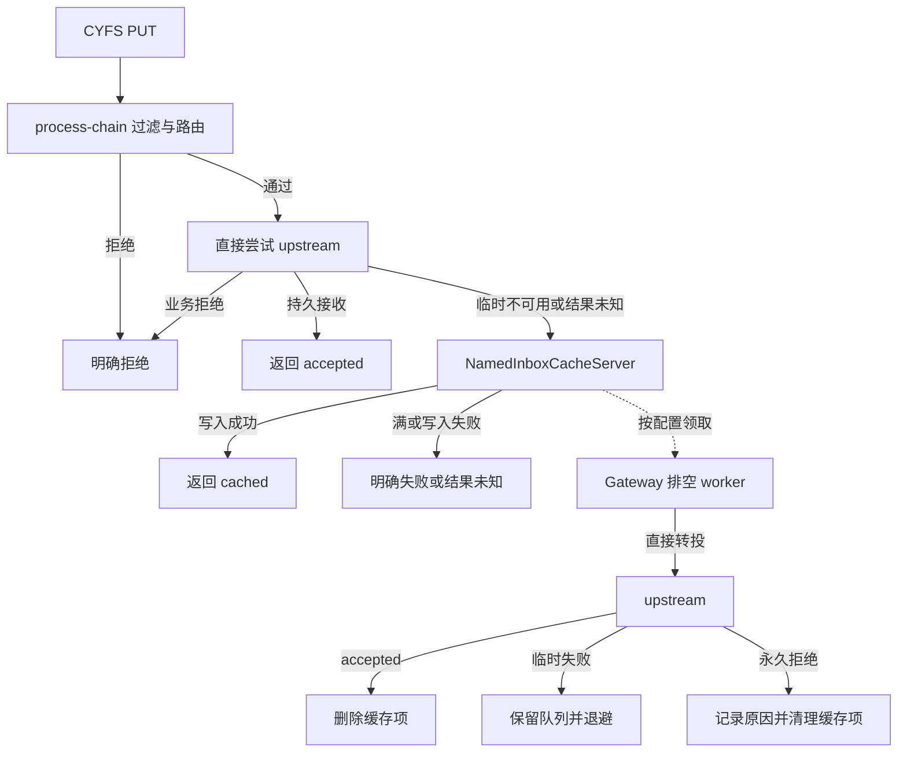

# NamedInboxCacheServer 与 dispatch 转投设计

状态：2026-09-05 设计补充，尚未实现。本文收敛公网 Gateway + 家庭 OOD 部署下的接收侧缓存需求；不宣称现有配置已经具备这些能力。

协议真相源是 [CYFS Protocol：dispatch](<../../cyfs-ndn/doc/CYFS Protocol/CYFS Protocol.md>) 中的「dispatch 结果与接收侧缓存」补充。本组件统一命名为 `NamedInboxCacheServer`，拟注册 server type 为 `named-inbox-cache`。

## 1. 目标与职责

Zone Gateway 的在线率可以高于 OOD。请求经过 Gateway process-chain 安全过滤后直接投递 upstream；BuckyOS 部署的 upstream 是 msg-center 的 CYFS 接收适配入口。只有 upstream 失效时，Gateway 才将请求转给配置的默认 NamedInboxCacheServer；缓存成功即返回 `cached`，容量不足则失败。Gateway 按配置运行后台 worker，将缓存对象转投 upstream。

缓存是尽力而为的，cached 之后对象仍可能丢失。发送方继续保存原对象并负责重试，只有 upstream 的 accepted 才能结束投递。本版不要求缓存持久队列、租约协议、终态回执保留或断电不丢；本地存储可以复用 NamedDataMgr 提高可用性，但不因此升级 cached 的承诺。

NamedInboxCacheServer 与 `cyfs-dir` 同属通用 CYFS 标准协议支持组件，可在没有 BuckyOS 的 gateway 宿主中使用。它处理 canonical JSON NamedObject、目标语义路径和认证上下文，不理解联系人、Session、群成员、Agent 或消息正文中的业务字段。

职责分开，允许同进程组合：

| 部分 | 职责 |
| --- | --- |
| process-chain | 请求安全过滤、身份验证、明确路由与配置的缓存目标选择 |
| Gateway dispatch 转发流程 | 保留可重放的小对象请求，尝试 upstream，识别协议结果，失败时调用缓存 |
| NamedInboxCacheServer | 缓存写入、去重、配额、取出/删除；可选提供当前缓存状态查询 |
| Gateway 排空 worker | 按配置领取缓存项，直接投 upstream，处理 accepted/rejected/临时失败 |
| upstream | 验证请求与应用 ACL，在持久事务中去重并完成业务接收，返回协议结果 |

默认缓存只适用于显式配置的 dispatch 路由。无路由的路径继续 `no-handler`，不能让全站任意 PUT 自动成为缓存写入。

## 2. 请求与结果

```text
PUT cyfs://<zone>/<semantic_path>
Content-Type: application/cyfs-named-object+json
body = canonical JSON NamedObject
```

缓存服务成功写入返回 `202 + cyfs-dispatch-status: cached`；upstream 持久接收返回 `200/201 + accepted`；明确拒绝携带 `reason/retryable`。无响应属于调用方无法确认的结果，没有可伪造为成功的 HTTP 状态。

缓存满但此前没有向 upstream 发出请求：可返回 `503 + rejected`，`reason=cache-full`、`retryable=true` 和 Retry-After。若 upstream 可能已处理，只是响应丢失，且 fallback 也失败：返回结果未知的网关错误；不能把缓存失败说成 upstream 拒绝。

缓存返回 cached 前必须完成本次写入，保存完整对象和转投上下文，不能只记录对象 URL 或尚未执行的异步写入任务。之后的故障、TTL 清理或缓存重建仍可能丢对象。不得自动 Pull 附件。正文超过单对象限制时明确拒绝，不能降级成无上限的磁盘缓冲。

## 3. Gateway 转发边界



Gateway 必须在发出小对象前保留有界、可重放的完整 body。连接成功、body 发出、upstream 实际完成、响应返回是不同阶段；响应丢失不等于没产生副作用。

明确的业务拒绝不进入 fallback。协议拒绝中的 retryable 表示发送方是否可以稍后尝试，不自动等于 Gateway 可以绕过 upstream 准入写缓存。仅连接故障或路由策略定义的服务暂不可用触发首次 fallback；已有缓存的临时转投失败由 worker 尽力保留重试。

排空使用 upstream 的直接路由，不重新调用公开 Gateway fallback URL。upstream 返回 cached 时保留缓存项并提示配置问题，不将其视为 accepted，也不实现级联缓存的责任转移。

process-chain 的 drop/reject 结果必须映射为失败或真实的连接丢弃。现有普通 HTTP/`cyfs-dir` 的 drop 分支可能构造默认 200 响应，dispatch 接入不得将这种响应解释为 accepted。

## 4. 缓存模型与重投

下面是逻辑字段，存储可复用现有 NamedDataMgr 与本地索引；无需 BuckyOS rdb_mgr 服务，不强制引入独立持久队列或新的存储依赖。

| 记录 | 必需内容 |
| --- | --- |
| 对象正文 | 经校验的 ObjectId、原始 canonical JSON、字节数、缓存引用 |
| 投递身份 | 目标 Zone、规范化 semantic path、ObjectId；同对象不同接收点分别记账 |
| 来源上下文 | 经验证的请求主体、必要的原始 proofs/cascades、接收时间、可信入口信息 |
| 路由信息 | 显式配置的 upstream 路由标识；物理地址变化可以重新解析，逻辑接收点不得改变 |
| 转投元数据 | 接收时间、可选过期时间、尝试次数、next_attempt_at、最后错误 |
| 可选结果记录 | upstream 确认过的 accepted/rejected；不要求长期保存 |

缓存可以配置 TTL 和启动清理。容量满时拒绝新写入，不能为写入失败的请求返回 cached；正常清理或故障后对象消失不违反 cached 的尽力语义。expires_at_ms 可以提示计划过期时间，但不是最短保管承诺。

必须区分“响应时已经写入成功”和“响应后保证不丢”。前者是 cached 的要求，后者不是。对象写入或必要索引更新在本次请求中报错时返回失败；若重启后发现不完整条目，可清理并依靠发送方重投恢复，不能把不完整条目查询成 cached。

排空默认可由单个后台循环完成，有限并发时使用本地协调避免同一项同时处理，无需先实现分布式租约。取对象不等于删除；upstream accepted 后删除，临时失败或无响应时尽力保留重试。永久业务拒绝时记录原因并允许清理。正文被多个条目或其他 NamedDataMgr 使用者引用时，只释放本条目引用，不直接删除共享对象。

upstream 已提交但响应丢失、或 Gateway 在接收成功后删除前崩溃，都会产生重投。发送方也会在缓存排空之前重试成功。upstream 必须在业务接收事务中以相同投递身份去重，并对已接收的同一对象返回 accepted。缓存可以丢失，整体推进依赖发送方保存原对象并重试；不能宣称缓存自身保证至少投递一次。

正常转发不以前置读取缓存或终态索引为条件。缓存里可能仍有发送方刚刚重试成功的同一对象，稍后再次转投由 upstream 幂等处理即可。发送方已收到 accepted 后不得被较早请求的迟到 cached 或无响应降级。

## 5. 查询与缓存清理

可选查询沿用本次 CYFS 补充；基础缓存和排空实现不依赖完整查询/回执系统：

```text
GET cyfs://<zone>/<semantic_path>?dispatch-status=<ObjectId>
```

查询先经认证。Gateway 优先查询 upstream；upstream 失效时可查缓存。结果使用 source=upstream|cache 标明来源。缓存里完整对象仍存在才可回答 cached；若无记录，unknown-dispatch 可以表示从未缓存、已丢失、过期或转投后删除，不能据此推断拒收。

排空成功可以直接删除缓存项，不要求持久终态回执。只有 upstream 的明确确认或对该确认的有效记录才能回答 accepted；对象不在缓存不等于 accepted。OOD 再次离线时查不到最终结果是允许的。

upstream 不支持查询、查询 unknown 或查询失败时，发送方按退避策略重新 PUT 原对象。cached 只影响重试节奏，不能结束投递；只有 accepted 才标成功。客户端重试使用同一对象，不能生成新 nonce 或修改正文来实现“重试”。

取出、删除等 worker 操作只对受信任 Gateway worker 开放，不是匿名公网 HTTP API。本版不新增任意远端缓存拉取与删除协议；默认缓存与 worker 在同一 gateway 宿主内组合使用。

## 6. 配置模型

以下为拟实现字段语义，不是目前已可使用的 YAML/DSL：

| 配置 | 用途 |
| --- | --- |
| accepted_paths / target_zone | 显式允许服务的 Zone 与语义接收点 |
| upstream / fallback_cache_server | 当前路由的处理目标与默认缓存组件 ID |
| store_config / cache_path | 对象缓存与本地索引位置 |
| max_object_bytes / max_entries / max_bytes | 对象与全局容量限制；同实例的并发写入原子检查 |
| per_principal_quota | 按认证主体的接收额度，可由入口策略进一步限制 |
| upstream_timeout / retry_backoff / concurrency | 同步转投预算与后台重试节奏 |
| drain_enabled / poll_interval | 启停排空与调度周期 |
| cache_ttl | 可选过期清理时间，不代表最短保管承诺 |

缓存独立运行、未配置 upstream 或 drain_enabled=false 时只提供明确配置的尽力暂存，不凭空寻找 BuckyOS 服务。若将其部署为自动转投路由的 fallback，配置检查应确认有对应 worker 与 upstream；暂停排空不改变 cached 的语义，也不能被误认为已完成接收。

缓存存储不依赖家庭 OOD 的磁盘或网络服务，否则不能覆盖 OOD 离线场景。凭据重放必须使用可信入口保存的来源上下文；不得把匿名调用者可设置的 header 当作 Gateway 自己的证明。缓存不冻结成员权限、不延长短期 token 有效期，业务准入仍由 upstream 决定。

## 7. 与当前代码的关系

| 现有入口 | 复用或缺口 |
| --- | --- |
| [cyfs_dir_server.rs](../src/components/cyfs-gateway-lib/src/server/cyfs_dir_server.rs) | 复用标准 ServerConfig/Context/Factory、NamedDataMgr 和 process-chain 接入方式；该组件目前主要负责读取，未实现 inbox 缓存与排空 |
| [http_server.rs](../src/components/cyfs-gateway-lib/src/server/http_server.rs) | 复用转发连接、超时和小 body 重放能力；现有 forward 的状态码重试不足以区分 cached 与 upstream accepted |
| [post_hook_point](http_post_hook_point.md) | 只能改响应 header，不能拿来做转投失败后的二次路由 |
| [server_registry.rs](../src/components/cyfs-gateway-app-lib/src/server_registry.rs) | 按 cyfs-dir 模式注册新 server，并接入宿主的 worker 生命周期与配置解析 |
| [cyfs_http.rs](../../cyfs-ndn/src/ndn-lib/src/cyfs_http.rs) | 已有 dispatch URL/content-type 检查与错误 header；需新增本次状态/查询的解析与构造 |
| BuckyOS msg-center | 目前只有 POST KRPC 入口；须新增 CYFS 接收/查询适配，不把原始 PUT 当作现有 KRPC body 直接转发 |

实施时优先使用独立 dispatch 转发模块组织上述语义，再由 process-chain 路由到该模块；不要改变所有普通 HTTP forward 的默认重试行为。具体命令/配置语法在实现时固定，并同步配置 parser 和注册测试。

## 8. 实现顺序与验收

1. 在 ndn-lib 补协议结果和查询的类型/解析，并确认同一目标的幂等键规范化规则。
2. 实现 NamedInboxCacheServer 的缓存写入、去重、原子配额和取出/删除操作；可选补当前缓存查询。
3. 接入 Gateway upstream 优先、fallback 与后台排空，以及启动恢复、停止和重载生命周期。
4. 实现 msg-center 的 CYFS 接收/查询适配，按路径限制本次本地接收目标；不得将多目标 MsgObject 中的其他目标误当成本次接收点一起确认。
5. 实现 MessageHub native executor 的 cached 结果处理和发送方重试；查询作为可选优化。cached 尚未最终交付，不能用现有 report_delivery(ok=true) 提前变成 delivered。

关键故障用例：

| 场景 | 预期 |
| --- | --- |
| 安全过滤拒绝 | 不访问 upstream，不写缓存，不返回伪 accepted |
| upstream 正常持久接收 | accepted；请求不经过缓存，缓存故障不影响正常转发 |
| upstream 明确业务拒绝 | rejected；无 fallback |
| OOD 离线、缓存可写 | 写入实际完成后 cached；发送方仍保留原对象和未完成记录 |
| 缓存满/磁盘写入失败 | 不返回 cached，不把临时不可用误报永久业务拒收 |
| upstream 实际接收但响应丢失 | 同对象 fallback/replay 后幂等收敛为 accepted，无重复业务副作用 |
| upstream 结果未知且缓存失败 | 对外结果未知；不误报 upstream 明确拒绝 |
| 排空后、删除前崩溃 | 缓存仍在时可重投，由 upstream 幂等；缓存丢失时由发送方重试推进 |
| TTL 到期/重启丢失缓存 | 不再查询为 cached，发送方同对象重试后仍可成功 |
| 排空时永久拒绝 | 记录原因，可停止重试并删除；不伪造 accepted |
| worker 与发送方同时投递 | upstream 幂等，缓存重复项不重复计额 |
| 同对象投递两个路径/Zone | 两份独立投递记录，正文允许共享 |
| OOD 再次离线、缓存已删除 | 允许查询 unknown/不可用，不根据缓存缺失返回 accepted |
| 上游又返回 cached | 保留本缓存，不产生 fallback 自循环 |
| 未安装/未运行 BuckyOS | 标准 NamedObject 的接收、查询与配置 upstream 转投仍可工作 |

验证须覆盖 HTTP 结果语义、缓存写入失败、允许的缓存丢失、发送方重试、配置注册和 Gateway+upstream 故障集成。本文为设计交付，以上测试尚未执行。
