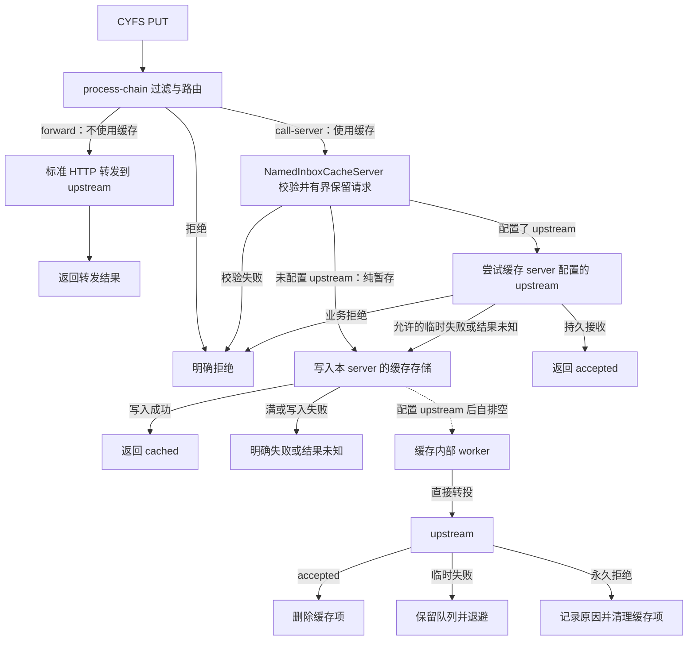

# NamedInboxCacheServer 与 dispatch 转投设计

状态：2026-09-05 已实现基础缓存、自排空、HTTP 接入、协议结果解析，以及 BuckyOS 接收适配和发送方重试。可运行配置、认证上下文约定与本版边界见 [使用说明](named_inbox_cache_usage.md)。Gateway 本地状态查询为可选能力，本版未开放；msg-center 已提供经认证的 upstream 查询。

协议真相源是 [CYFS Protocol：dispatch](<../../cyfs-ndn/doc/CYFS Protocol/CYFS Protocol.md>) 中的「dispatch 结果与接收侧缓存」补充。本组件统一命名为 `NamedInboxCacheServer`，注册 server type 为 `named-inbox-cache`。

## 1. 目标与职责

Zone Gateway 的在线率可以高于 OOD。请求经过 Gateway process-chain 安全过滤后，由路由规则选择是否使用缓存：不需要缓存时，使用标准 `forward <upstream>` 直接投递；需要缓存时，使用标准 `call-server <cache-server-id>` 调用配置了 upstream 的 NamedInboxCacheServer。BuckyOS 部署的 upstream 是 msg-center 的 CYFS 接收适配入口。

NamedInboxCacheServer 先有界读取完整小对象，再尝试自身配置的 upstream。upstream 持久接收或明确拒绝时直接返回结果；仅在连接故障、超时等允许的失败情况下写入本地缓存，实际写入成功才返回 `cached`。同一个 upstream 配置也用于内部 worker 自排空。因此正常请求会经过缓存 server 的处理函数，但不读写缓存存储；本文的“upstream 优先”与“正常路径不经过缓存”均指先尝试接收、不前置落缓存。

缓存是尽力而为的，cached 之后对象仍可能丢失。发送方继续保存原对象并负责重试，只有 upstream 的 accepted 才能结束投递。本版不要求缓存持久队列、租约协议、终态回执保留或断电不丢；本地存储可以复用 NamedDataMgr 提高可用性，但不因此升级 cached 的承诺。

NamedInboxCacheServer 与 `cyfs-dir` 同属通用 CYFS 标准协议支持组件，可在没有 BuckyOS 的 gateway 宿主中使用。它处理 canonical JSON NamedObject、目标语义路径和认证上下文，不理解联系人、Session、群成员、Agent 或消息正文中的业务字段。

职责分开，允许同进程组合：

| 部分 | 职责 |
| --- | --- |
| HTTP process-chain | 请求安全过滤、身份验证；通过 forward 选择直接投递，或通过 call-server 选择提供缓存能力的 server |
| HTTP 执行层 | 按现有 forward / call-server 语义转发或调用本地 server，并将响应交回客户端 |
| NamedInboxCacheServer | 有界读取和校验小对象；先投自身 upstream、识别协议结果、失败后暂存；缓存去重、配额和自排空；可选提供当前缓存状态查询 |
| 缓存内部排空 worker | 按缓存配置领取缓存项，直接投 upstream，处理 accepted/rejected/临时失败；生命周期归属缓存 server |
| upstream | 验证请求与应用 ACL，在持久事务中去重并完成业务接收，返回协议结果 |

缓存能力只适用于显式路由到该 server 的 dispatch 请求，并受其 target_zone / accepted_paths 限制。无路由的路径继续 `no-handler`，不能让全站任意 PUT 自动成为缓存写入。

## 2. 请求与结果

```text
PUT cyfs://<zone>/<semantic_path>
Content-Type: application/cyfs-named-object+json
body = canonical JSON NamedObject
```

缓存服务成功写入返回 `202 + cyfs-dispatch-status: cached`；upstream 持久接收返回 `200/201 + accepted`；明确拒绝携带 `reason/retryable`。无响应属于调用方无法确认的结果，没有可伪造为成功的 HTTP 状态。

缓存满但此前没有向 upstream 发出请求：可返回 `503 + rejected`，`reason=cache-full`、`retryable=true` 和 Retry-After。若 upstream 可能已处理，只是响应丢失，且 fallback 也失败：返回结果未知的网关错误；不能把缓存失败说成 upstream 拒绝。

缓存返回 cached 前必须完成本次写入，保存完整对象和转投上下文，不能只记录对象 URL 或尚未执行的异步写入任务。之后的故障、TTL 清理或缓存重建仍可能丢对象。不得自动 Pull 附件。正文超过单对象限制时明确拒绝，不能降级成无上限的磁盘缓冲。

## 3. 路由与缓存 server 的处理边界



NamedInboxCacheServer 必须在发出小对象前保留有界、可重放的完整 body。连接成功、body 发出、upstream 实际完成、响应返回是不同阶段；响应丢失不等于没产生副作用。

首次投递、失败后的缓存写入与后台排空都在 NamedInboxCacheServer 内完成；upstream 只在这个 server 上配置一次。process-chain 的 call-server 仍是终止路由动作，HTTP 宿主调用该 server 后直接返回响应，不需要让脚本捕获网络失败或继续执行下一条命令。直接 forward 的路径保持现有行为，不自动使用缓存。

明确的业务拒绝不进入 fallback。协议拒绝中的 retryable 表示发送方是否可以稍后尝试，不自动等于缓存 server 可以绕过 upstream 准入写缓存。仅连接/传输故障、超时或明确配置的服务暂不可用条件触发首次 fallback；不把所有非 2xx 或 5xx 当成缓存条件。已有缓存的临时转投失败由 worker 尽力保留重试。

排空直接调用自身配置的 upstream，不重新调用公开 Gateway URL 或本 server 的入站处理函数，避免再次进入“先投递、失败后缓存”的流程。upstream 返回 cached 时保留缓存项并提示配置问题，不将其视为 accepted，也不实现级联缓存的责任转移。

process-chain 的 drop/reject 结果必须映射为失败或真实的连接丢弃。现有普通 HTTP/`cyfs-dir` 的 drop 分支可能构造默认 200 响应，dispatch 接入不得将这种响应解释为 accepted。

## 4. 缓存模型与重投

下面是逻辑字段，存储可复用现有 NamedDataMgr 与本地索引；无需 BuckyOS rdb_mgr 服务，不强制引入独立持久队列或新的存储依赖。

| 记录 | 必需内容 |
| --- | --- |
| 对象正文 | 经校验的 ObjectId、原始 canonical JSON、字节数、缓存引用 |
| 投递身份 | 目标 Zone、规范化 semantic path、ObjectId；同对象不同接收点分别记账 |
| 来源上下文 | 经验证的请求主体、必要的原始 proofs/cascades、接收时间、可信入口信息 |
| 路由信息 | 所属缓存实例及其配置的 upstream 逻辑接收点；物理地址变化可以重新解析，逻辑接收点不得改变 |
| 转投元数据 | 接收时间、可选过期时间、尝试次数、next_attempt_at、最后错误 |
| 可选结果记录 | upstream 确认过的 accepted/rejected；不要求长期保存 |

缓存可以配置 TTL 和启动清理。容量满时拒绝新写入，不能为写入失败的请求返回 cached；正常清理或故障后对象消失不违反 cached 的尽力语义。expires_at_ms 可以提示计划过期时间，但不是最短保管承诺。

必须区分“响应时已经写入成功”和“响应后保证不丢”。前者是 cached 的要求，后者不是。对象写入或必要索引更新在本次请求中报错时返回失败；若重启后发现不完整条目，可清理并依靠发送方重投恢复，不能把不完整条目查询成 cached。

排空默认可由单个后台循环完成，有限并发时使用本地协调避免同一项同时处理，无需先实现分布式租约。取对象不等于删除；upstream accepted 后删除，临时失败或无响应时尽力保留重试。永久业务拒绝时记录原因并允许清理。正文被多个条目或其他 NamedDataMgr 使用者引用时，只释放本条目引用，不直接删除共享对象。

upstream 已提交但响应丢失、或 Gateway 在接收成功后删除前崩溃，都会产生重投。发送方也会在缓存排空之前重试成功。upstream 必须在业务接收事务中以相同投递身份去重，并对已接收的同一对象返回 accepted。缓存可以丢失，整体推进依赖发送方保存原对象并重试；不能宣称缓存自身保证至少投递一次。

配置 upstream 时，缓存 server 的同步投递不以前置读取缓存、检查缓存容量或查询终态索引为条件。缓存里可能仍有发送方刚刚重试成功的同一对象，稍后再次转投由 upstream 幂等处理即可。发送方已收到 accepted 后不得被较早请求的迟到 cached 或无响应降级。

## 5. 查询与缓存清理

可选查询沿用本次 CYFS 补充；基础缓存和排空实现不依赖完整查询/回执系统：

```text
GET cyfs://<zone>/<semantic_path>?dispatch-status=<ObjectId>
```

查询先经认证并检查查询权限。若实现此可选能力，HTTP 规则把查询请求 call-server 到同一个 NamedInboxCacheServer，由它优先查询自身配置的 upstream；upstream 失效时可查本地缓存，未配置 upstream 时仅查本地。结果使用 source=upstream|cache 标明来源。缓存里完整对象仍存在才可回答 cached；若无记录，unknown-dispatch 可以表示从未缓存、已丢失、过期或转投后删除，不能据此推断拒收。

排空成功可以直接删除缓存项，不要求持久终态回执。只有 upstream 的明确确认或对该确认的有效记录才能回答 accepted；对象不在缓存不等于 accepted。OOD 再次离线时查不到最终结果是允许的。

upstream 不支持查询、查询 unknown 或查询失败时，发送方按退避策略重新 PUT 原对象。cached 只影响重试节奏，不能结束投递；只有 accepted 才标成功。客户端重试使用同一对象，不能生成新 nonce 或修改正文来实现“重试”。

取出、删除等 worker 操作只对缓存 server 内部的受信任 worker 开放，不是匿名公网 HTTP API。本版不新增任意远端缓存拉取与删除协议；缓存与其自排空 worker 在同一 gateway 宿主内运行。

## 6. 配置模型

以下字段已由配置 parser 支持；本版使用 `cache_path` 保存独立的本地完整记录，不需要 `store_config` 或 NamedDataMgr：

| 配置位置 | 配置 | 用途 |
| --- | --- | --- |
| HTTP process-chain | `forward <url>` | 不使用缓存时直接转发，沿用现有命令与失败处理 |
| HTTP process-chain | `call-server <cache-server-id>` | 使用缓存时调用本地 NamedInboxCacheServer，沿用现有命令语义 |
| 缓存 server | `accepted_paths` / `target_zone` | 显式允许缓存的 Zone 与语义接收点 |
| 缓存 server | `upstream` | 同步首次投递和后台排空共用的直接目标；配置后先投 upstream，并默认启动内部 worker |
| 缓存 server | `store_config` / `cache_path` | 对象缓存与本地索引位置 |
| 缓存 server | `max_object_bytes` / `max_entries` / `max_bytes` | 单对象读取/重放上限与缓存全局容量限制；同实例的并发写入原子检查 |
| 缓存 server | `per_principal_quota` | 按认证主体的接收额度，可由入口策略进一步限制 |
| 缓存 server | `upstream_timeout` / `retry_backoff` / `concurrency` | 每次同步投递或后台转投的预算、后台失败退避与后台并发数 |
| 缓存 server | `drain_enabled` / `poll_interval` | 有 upstream 时默认启用排空；可显式暂停，或调整调度周期 |
| 缓存 server | `cache_ttl` | 可选过期清理时间，不代表最短保管承诺 |

缓存未配置 upstream 时，合法请求在配额内直接暂存，写入完成后返回 cached；不启动排空，也不从请求内容推断 upstream。配置 upstream 后，新请求先同步投递，内部 worker 默认自排空。`drain_enabled=false` 仅暂停后台排空，新请求仍先尝试 upstream；`drain_enabled=true` 却缺少 upstream 应报配置错误。worker 随缓存 server 启动、停止和重载，由缓存自身管理，不需要另外配置转发 server 或 timer。暂停排空不改变 cached 的语义，也不能被误认为已完成接收。

使用缓存的 HTTP 规则只选择缓存 server ID，upstream 的配置与解析由缓存 server 统一负责。多个规则可以共用同一缓存，但实际目标必须在缓存允许范围内；物理地址变化不得改变原投递的逻辑接收点。将同一路由从 call-server 改为 forward 时，直连目标应保持同一逻辑接收点；已存在的缓存项仍由缓存内部 worker 独立排空。

缓存存储不依赖家庭 OOD 的磁盘或网络服务，否则不能覆盖 OOD 离线场景。凭据重放必须使用可信入口保存的来源上下文；不得把匿名调用者可设置的 header 当作 Gateway 自己的证明。缓存不冻结成员权限、不延长短期 token 有效期，业务准入仍由 upstream 决定。

## 7. 在 process-chain 中使用的完整例子

### 7.1 场景与接入方式

Bob 向 `cyfs://alice.example/messages/inbox` 投递一个小对象 `M`。Alice 的公网 Gateway 在线，家庭 OOD 上的 msg-center CYFS 接收适配入口可能离线。希望正常时直接接收，OOD 离线时由 Gateway 本地暂存，恢复后再转投。

同一个接收点可以选择两种路由方式。以下两条语句是互斥的配置选择，均在认证和路由检查通过后执行：

```text
# 不使用缓存：标准 HTTP 转发，失败按现有 forward 语义返回。
forward "http://10.0.0.2:4050";
```

```text
# 使用缓存：由该 server 先投自身 upstream，失败后暂存，并自行排空。
call-server alice_inbox_cache;
```

下面给出使用缓存的完整 server 配置。`zone_http` 只选择 `alice_inbox_cache`，upstream 在缓存 server 中只配置一次。这是一份已由实现支持的配置示例，使用前须配置前置认证并设置内部 `AUTH_principal`：`type: http`、process-chain、`forward`、`call-server`、`error`、`reject` 均已有；新增的是 `named-inbox-cache` 的同步投递、失败暂存和自排空能力。缓存配置字段已与 parser 一并固定。

本例的入口只服务 Alice 的 dispatch 请求。已有监听 stack 将请求交给 `zone_http`；TLS、Zone 解析和 Gateway 到 OOD 的隧道配置略去。`10.0.0.2:4050` 是隧道内 OOD 的 **CYFS 接收适配入口**，适配器与 KRPC 共用 HTTP 监听端口，但按 method/path 分流；upstream 地址只改变物理连接目标，仍投递到原 Zone 的 `/messages/inbox`。

以下规则片段位于站点已有的身份认证与安全过滤通过之后，假定已经验证 Bob 的身份并保留可信来源上下文；前置认证规则按部署配置，此处省略。认证失败或策略拒绝必须在执行 `call-server` 或 `forward` 前结束请求。`cyfs-original-user` 只是声明，不能直接作为认证结果；HTTP 宿主调用缓存 server 时须通过内部请求上下文传递认证主体及必要的原始 proofs/cascades，HTTP 宿主在规则执行后读取 `AUTH_principal`，通过 `VerifiedDispatchContext` 扩展传给缓存；原始凭据在规则执行前保留。该变量必须由认证结果赋值，不能直接取匿名请求的身份声明。

```yaml
servers:
  zone_http:
    type: http
    hook_point:
      main:
        priority: 1
        blocks:
          route:
            priority: 1
            block: |
              # 本片段在站点认证与安全过滤通过后执行。
              ne $REQ.host "alice.example" && reject;
              ne $REQ.path "/messages/inbox" && error 404 "no-handler";
              ne $REQ.method "PUT" && error 405 "method-not-allowed";
              ne $REQ_content_type "application/cyfs-named-object+json" && error 415 "unsupported-content-type";

              call-server alice_inbox_cache;

  alice_inbox_cache:
    type: named-inbox-cache                 # 先投 upstream，失败暂存，自排空
    target_zone: alice.example
    accepted_paths:
      - /messages/inbox                    # 精确接收点，不是 /messages/*

    upstream: "http://10.0.0.2:4050"        # 首次同步投递与后台转投共用
    upstream_timeout: 3s                   # 每次同步投递或后台转投的超时
    poll_interval: 5s
    concurrency: 2
    retry_backoff: [5s, 30s, 2m, 10m]         # 到上限后保持 10m 间隔
    # drain_enabled: false                 # 可选：仅暂停后台排空，仍先同步投 upstream

    cache_path: /var/lib/cyfs-gateway/inbox/alice
    max_object_bytes: 65536                # 同步读取、重放和缓存的单对象上限：64 KiB
    max_entries: 10000
    max_bytes: 268435456                    # 256 MiB
    per_principal_quota:
      max_entries: 1000
      max_bytes: 16777216                   # 每个认证主体 16 MiB
    cache_ttl: 24h                          # 允许提前丢失，不承诺至少保管 24h
```

`call-server alice_inbox_cache` 直接进入这个 server 的请求处理函数。它在 `max_object_bytes` 上限内保留完整对象，并先尝试 `upstream`。本例只在连接/传输错误或超时时转入本地缓存写入；明确业务拒绝、正文非法、超限、入口拒绝和本地配置错误都不触发 fallback。缓存写入失败后直接结束本次请求，不递归写入其他缓存。

`upstream_timeout: 3s` 是每次同步投递或后台转投的总预算，覆盖连接、发送、等待响应及确认协议结果；到期后按超时处理。完整对象在发送前就已保留，因此即使 upstream 已经消费请求但响应丢失，仍可缓存同一对象；重复业务副作用由 upstream 的事务去重避免。有界读取用于本次请求的重放，不算缓存成功，也不使请求提前进入缓存队列。

NamedInboxCacheServer 在首次投递或纯暂存前检查规范化 Zone/path、method、content-type，禁止 inner_path，校验 canonical JSON、实际 body 大小和可信来源上下文；目标必须在自身允许范围内。入口和缓存 server 都不读取 `M` 的业务字段，upstream 仍独立执行应用 ACL。本例只展示 PUT；可选 GET 查询须另配 HTTP 规则并调用同一缓存 server 的查询处理，校验查询参数与查询权限，不执行写缓存动作。

脚本中的 `error` / `reject` 是现有 HTTP 控制动作；它们目前不会自动生成完整 dispatch 状态体。HTTP 入口已补齐这类请求的协议错误映射，例如 `error 404 "no-handler"` 对应 `404 + rejected`、`reason=no-handler`、`retryable=false`，并按第 2 节构造 header 和 JSON 状态体。进入 NamedInboxCacheServer 后，由它构造或验证相应协议响应；入口放行或生成 call-server 动作本身不表示 upstream 已 accepted。

### 7.2 一次请求如何执行

发送方提交以下请求；`M` 表示完整、已经 canonical 化的 NamedObject，`O = ObjectId(M)`，下文响应中的 `<O>` 是这个实际 ObjectId 的占位符：

```http
PUT /messages/inbox HTTP/1.1
Host: alice.example
Content-Type: application/cyfs-named-object+json
cyfs-original-user: did:bns:bob
cyfs-proofs: <可验证本次请求的原始证明，具体格式按认证机制>

<M 的完整 canonical JSON，大小不超过 65536 字节>
```

1. 请求通过站点认证与安全过滤，`zone_http` 的 process-chain 匹配 Host、路径、method 和 content-type，执行 `call-server alice_inbox_cache`，结束本次路由脚本。HTTP 宿主把原请求和可信上下文交给该 server。
2. NamedInboxCacheServer 校验请求并在 64 KiB 上限内保留完整 body，以及原目标、认证主体和必要的原始凭据。超限或校验失败直接拒绝，不向 upstream 发出请求。
3. NamedInboxCacheServer 按自身 `upstream` 配置直接 PUT 到 OOD 的适配入口，保留 `M`、原目标和可信来源上下文。此时不读写缓存存储，不前置检查缓存容量或可写性；缓存满或存储写入故障不阻止可服务实例的同步 upstream 投递。
4. 若 upstream 完成持久接收并返回匹配 `O` 和目标的 `accepted`，NamedInboxCacheServer 返回该协议结果。若 upstream 明确业务拒绝，返回拒绝结果；即使 `retryable=true`，也不因这一标志进入缓存。
5. 若同步投递发生连接/传输错误或超时，NamedInboxCacheServer 转入自己的缓存写入流程。它按 `(alice.example, /messages/inbox, O)` 去重，并在配额内实际写入完整对象、认证上下文、原投递目标和所属缓存标识，完成后才返回 `cached`；后续排空使用同一 upstream。重复项不重复占额；并发写入原子检查实例和主体额度。

OOD 离线且实际缓存成功时，发送方看到：

```http
HTTP/1.1 202 Accepted
Content-Type: application/json
Cache-Control: no-store
cyfs-dispatch-status: cached

{"obj_id":"<O>","target":"cyfs://alice.example/messages/inbox","status":"cached"}
```

这里 HTTP 状态行中的 `Accepted` 是 202 的标准描述；投递状态仍以 `cyfs-dispatch-status: cached` 和 JSON 状态体为准。它表示 Gateway 此刻已暂存，**不表示对象已进入 msg-center inbox**。Bob 保留原对象和未完成投递记录，之后可退避重试同一个 PUT。

这里沿用 call-server 的终止路由语义：HTTP 宿主等待缓存 server 的完整响应后直接交回客户端。首次投递失败后的处理发生在缓存 server 内部，process-chain 无需通过 `||` 捕获结果，也无需新增非终止调用命令。`post_hook_point` 仍只负责响应头后处理。

### 7.3 OOD 恢复后的排空与发送方重试

`alice_inbox_cache` 创建时发现自身配置了 upstream，默认启动内部排空 worker，无需新的入站请求触发。worker 每 5 秒检查仍存在且到达 `next_attempt_at` 的缓存项，最多并发处理 2 项。领取只做本地协调，**不会先删除缓存**。每一项直接使用缓存配置的 upstream 地址重投相同的 `M` 和原目标，不重新请求 `zone_http`，也不调用本 server 的入站处理函数。缓存停止时停止 worker，重载时按缓存配置更新调度和 upstream；已有项的逻辑接收点保持不变。

| worker 收到的结果 | 对 `alice_inbox_cache` 的操作 |
| --- | --- |
| `200/201 + accepted`，对象与目标匹配 | 删除对应投递项，释放它持有的正文引用 |
| 连接失败、超时、结果未知，或可重试拒绝 | 尽力保留，更新尝试次数和下次重试时间 |
| 永久业务拒绝 | 记录原因，停止该项重试并允许清理，不转成 accepted |
| `202 + cached` | 保留并报告 upstream 配置问题，不视为已交付 |

例如，t0 时 OOD 离线，NamedInboxCacheServer 同步投递失败后缓存 `M`，并向 Bob 返回 cached；t1 时 OOD 恢复，worker 转投后收到 accepted 并删除缓存；t2 时 Bob 用同一 `M` 重试，再经 call-server 进入同一缓存 server，由它先投 upstream，upstream 的事务去重返回 accepted，Bob 此时才结束投递。worker 收到 accepted 不会主动向已经结束的 t0 请求追加响应，本例也不新增回调通知。

若 Bob 在 t1 之前已重试成功，缓存里可以暂时还有 `M`，worker 后续重投同样由 upstream 幂等处理。若 t0 之后 Gateway 丢失缓存或 TTL 清理了对象，则依靠 Bob 的同对象重试继续推进。查询只是可选优化：OOD 在线时可查 upstream 得到 accepted；OOD 再次离线且缓存已删除时，可以查到 unknown，不能由缓存缺失推断 accepted。

### 7.4 用这个例子核对设计意图

| 操作或故障 | 对外结果与可观察行为 |
| --- | --- |
| Bob 投递到 `/messages/inbox`，OOD 正常 | 经 call-server 进入缓存 server 后先投 upstream；持久接收后 accepted，缓存存储读写次数为 0 |
| Bob 投递到 `/other/inbox` | `404 + rejected`，`reason=no-handler`；不访问 upstream，不写缓存 |
| 伪造 Bob 的 header，或入口策略拒绝 | 认证/策略失败；不访问 upstream，不写缓存，不产生 accepted |
| 正文超过 64 KiB，包括流式超限 | `413 + rejected`；停止读取，不投 upstream，不写缓存 |
| OOD 连接失败，缓存可写 | 实际写入成功后 `202 + cached`；发送方继续保留并重试 |
| OOD 明确业务拒绝，包括可重试拒绝 | 原样返回 rejected；首次 fallback 次数为 0 |
| OOD 普通 500 或缺少协议状态的 200 | 不解释为 accepted；本例的缓存策略不按普通状态码触发 fallback，返回无法确认的网关错误 |
| 确定未向 OOD 发出请求，缓存已满 | `503 + rejected`，`reason=cache-full`、`retryable=true`，附 Retry-After |
| OOD 可能已提交但响应超时，缓存可写 | 允许 cached；后续原对象重投由 upstream 幂等接收 |
| OOD 可能已提交但响应超时，缓存写入失败 | `504`，`cyfs-dispatch-error: upstream-outcome-unknown`；不声称 rejected 或 cached |
| OOD 恢复，worker 收到 accepted | 只删除对应投递项；发送方重试或查询后确认 accepted |
| 缓存配置 upstream，之后没有新请求 | 缓存自身 worker 仍定期尝试排空 |
| 缓存未配置 upstream | 合法请求在配额内直接暂存并返回 cached，不自排空 |
| 缓存配置 upstream，但 `drain_enabled=false` | 新请求仍先同步投 upstream、失败后暂存；已有项暂停后台转投 |
| 同一路由选择直接 forward | 使用标准 HTTP 转发，失败不会写入 NamedInboxCacheServer |

是否使用缓存由命中的 HTTP 路由动作决定：直接 forward 就直接投 upstream；call-server 到配置了 upstream 的缓存 server，就获得“先投递、失败暂存、自排空”的行为。将 call-server 改为 forward 后，新请求不再经过缓存 server；只要缓存实例仍运行且启用排空，已有缓存项继续独立转投。移除缓存的 upstream 则切换为纯暂存，设置 `drain_enabled=false` 则仅暂停后台排空，发送方的重试责任均不改变。

## 8. 与当前代码的关系

| 现有入口 | 复用或缺口 |
| --- | --- |
| [call-server](../src/components/cyfs-gateway-lib/src/cmds/server.rs) | 沿用现有 server ID 路由动作，调用 NamedInboxCacheServer 并直接返回其响应；无需新增命令或改变控制流语义 |
| [forward.rs](../src/components/cyfs-gateway-lib/src/cmds/forward.rs) | 不使用缓存时沿用标准转发；本设计不增加缓存专用选项 |
| [cyfs_dir_server.rs](../src/components/cyfs-gateway-lib/src/server/cyfs_dir_server.rs) | 复用标准 ServerConfig/Context/Factory、NamedDataMgr 和 process-chain 接入方式；该组件目前主要负责读取，未实现 inbox 缓存与排空 |
| [http_server.rs](../src/components/cyfs-gateway-lib/src/server/http_server.rs) | 沿用调用本地 HTTP server 的入口；已补齐可信上下文传递与入口 dispatch 错误映射；先投递和失败暂存由缓存 server 实现 |
| [post_hook_point](http_post_hook_point.md) | 只能改响应 header，不能拿来做转投失败后的二次路由 |
| [server_registry.rs](../src/components/cyfs-gateway-app-lib/src/server_registry.rs) | 已注册 named-inbox-cache 并接入缓存配置解析；缓存自身根据 upstream 管理 worker 生命周期 |
| [cyfs_http.rs](../../cyfs-ndn/src/ndn-lib/src/cyfs_http.rs) | 保留 dispatch URL/content-type 检查；新增 [cyfs_dispatch.rs](../../cyfs-ndn/src/ndn-lib/src/cyfs_dispatch.rs) 提供状态/查询、规范化与正文校验 |
| BuckyOS msg-center | 已新增 [CYFS 接收/查询适配](../../buckyos/src/frame/msg_center/src/cyfs_dispatch.rs)，与 POST KRPC 入口分流；配置与发送端路由见使用说明 |

本实现在 NamedInboxCacheServer 内部完成有界读取、upstream 优先、失败暂存和自排空；同步投递与后台转投复用协议解析和直接 upstream 调用函数，worker 不调用入站处理函数。配置层只使用现有 forward / call-server 路由动作和新缓存 server；不新增 dispatch 转发 server，也不扩展 forward 的缓存失败选项。缓存配置语法已固定，并同步了配置 parser 和注册测试。

## 9. 实现顺序与验收

1. 在 ndn-lib 补协议结果和查询的类型/解析，并确认同一目标的幂等键规范化规则。
2. 实现 NamedInboxCacheServer 的有界对象读取和校验、同步 upstream 优先、失败暂存、去重与原子配额；未配置 upstream 时支持纯暂存。
3. 接入现有 call-server 路由、可信认证上下文传递和 dispatch 结果/错误映射；根据缓存自身 upstream 配置接入自排空、启动恢复、停止和重载生命周期，可选补当前缓存查询。
4. 实现 msg-center 的 CYFS 接收/查询适配，按路径限制本次本地接收目标；不得将多目标 MsgObject 中的其他目标误当成本次接收点一起确认。
5. 实现 MessageHub native executor 的 cached 结果处理和发送方重试；查询作为可选优化。cached 尚未最终交付，不能用现有 report_delivery(ok=true) 提前变成 delivered。

关键故障用例：

| 场景 | 预期 |
| --- | --- |
| 安全过滤拒绝 | 不访问 upstream，不写缓存，不返回伪 accepted |
| call-server 后 upstream 正常持久接收 | accepted；经过缓存 server 的处理函数但不读写缓存存储，不前置检查缓存容量或可写性 |
| upstream 明确业务拒绝 | rejected；无 fallback |
| OOD 离线、缓存可写 | 写入实际完成后 cached；发送方仍保留原对象和未完成记录 |
| 缓存满/磁盘写入失败 | 不返回 cached，不把临时不可用误报永久业务拒收 |
| upstream 实际接收但响应丢失 | 同对象 fallback/replay 后幂等收敛为 accepted，无重复业务副作用 |
| upstream 结果未知且缓存失败 | 对外结果未知；不误报 upstream 明确拒绝 |
| 排空后、删除前崩溃 | 缓存仍在时可重投，由 upstream 幂等；缓存丢失时由发送方重试推进 |
| TTL 到期/重启丢失缓存 | 不再查询为 cached，发送方同对象重试后仍可成功 |
| 排空时永久拒绝 | 记录原因，可停止重试并删除；不伪造 accepted |
| worker 与发送方同时投递 | upstream 幂等，缓存重复项不重复计额 |
| 同对象投递两个路径/Zone | 两份独立投递记录，正文允许共享 |
| OOD 再次离线、缓存已删除 | 允许查询 unknown/不可用，不根据缓存缺失返回 accepted |
| 上游又返回 cached | 保留本缓存，不产生 fallback 自循环 |
| 缓存配置 upstream，入站流量停止 | 内部 worker 仍按配置自排空，不依赖新请求 |
| 缓存未配置 upstream | 合法请求在配额内直接暂存，不启动同步投递或后台排空 |
| 缓存暂停后台排空 | 新请求仍先同步投 upstream；缓存启动、停止与重载正确管理 worker，已有项不改变逻辑接收点 |
| HTTP 规则选择直接 forward | 保持现有转发行为，不调用缓存 server；仍在运行的缓存实例可继续排空已有项 |
| 未安装/未运行 BuckyOS | 标准 NamedObject 的接收、查询与配置 upstream 转投仍可工作 |

验证须覆盖 HTTP 结果语义、缓存写入失败、允许的缓存丢失、发送方重试、配置注册和 Gateway+upstream 故障集成。本次实现已添加协议、Gateway HTTP 故障、配置注册、BuckyOS 接收事务与发送重试测试。验证命令和可选能力边界见 [使用说明](named_inbox_cache_usage.md)。
