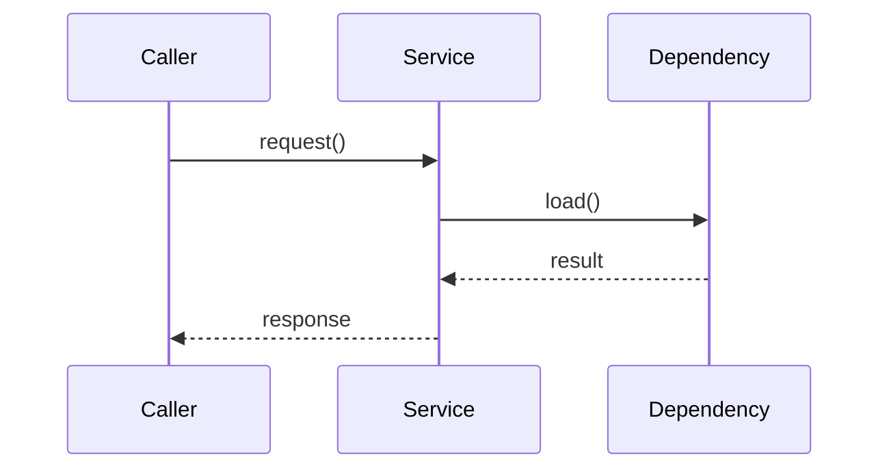

# [模块名] 设计

> 本文件只描述实现方案，不承载完整测试策略。测试策略写在 `testing.md`。

## 元数据
- version: v0.6
- module: [模块名]
- stage: design
- status: draft
- approved_by:
- approved_at:

## 设计范围
### 目标
### 非目标

## 总体方案
<!-- 说明主要实现路径、层次、数据流与关键交互 -->

## 模块拆解
| 子模块 | 类型 | 职责 | 输入 | 输出 | 依赖 | 是否拆分独立文档 |
|--------|------|------|------|------|------|------------------|
| 示例子模块 | assembly / runtime / shared / ui | | | | | 否 |

## 实现顺序
| 阶段 | 目标 | 前置条件 | 输出 | 依赖 | 是否可并行 |
|------|------|----------|------|------|------------|
| 1 | | | | | 否 |

## 关键决策
<!-- 解释为什么采用该方案，以及拒绝了什么 -->

## 接口与依赖
### 对外接口摘要
### 配置与运行时接口
### 外部依赖约束

## Rust 类型与接口设计
> 涉及 Rust 代码时必填。详细要求见 `harness/rules/rust-design-doc-rules.md`。

| 类型 / 接口 | 路径 | 可见性 | 职责 | 输入 | 输出 | 错误 | 所有权 / 生命周期 |
|-------------|------|--------|------|------|------|------|-------------------|
| | | | | | | | |

## 主要流程调用逻辑
> 涉及 Rust 代码时必须说明入口、核心实现、外部依赖、异步边界、shutdown 和 error 路径。



## Rust 错误处理、并发与生命周期
### 错误处理
### 异步任务与 shutdown
### 共享状态与资源所有权
### 配置注入与测试替身

## 实现布局
```text
[module-root]
├── [dir-or-file]
└── ...
```

| 路径 | 类型 | 职责 | 备注 |
|------|------|------|------|
| | | | |

### Rust 文件与目录结构
> 涉及 Rust 代码时必填；路径从仓库根或 `src/` 工作区根开始。

```text
src/
└── [crate-or-app]/
    └── src/
        └── [module]/
            ├── mod.rs
            └── [file].rs
```

| 路径 | 新增 / 修改 | 职责 | 导出关系 | 测试归属 |
|------|-------------|------|----------|----------|
| | | | | |

## 文档索引
| 文档 | 主题 | 范围 |
|------|------|------|
| `design.md` | 模块总览 | 完整模块 |

## 实现准入映射
| Proposal 条目 ID | Design 条目 / 章节 | 相关路径或接口 | 哪些改动仍需先补 design |
|------------------|--------------------|----------------|--------------------------|
| P-example-change | | | |

## 风险与回滚
<!-- 说明实现、迁移、兼容性与回滚策略 -->
