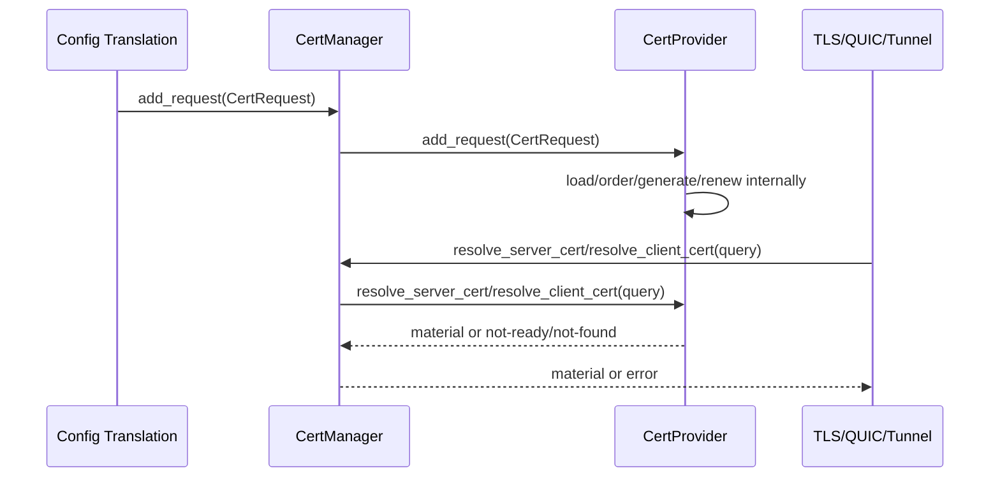
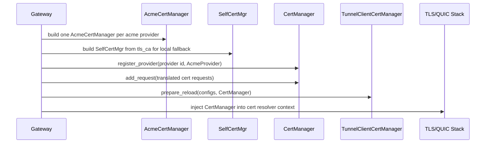
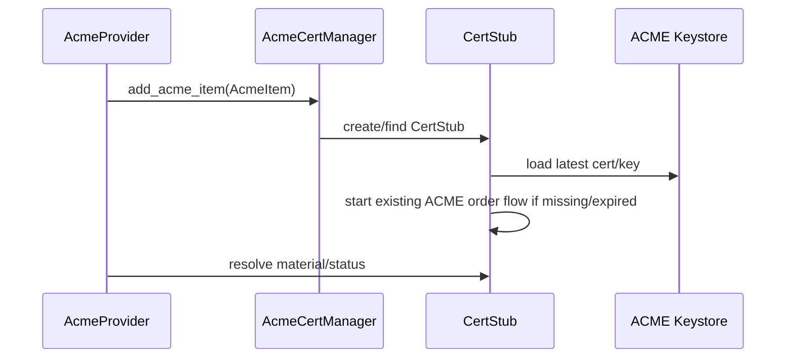
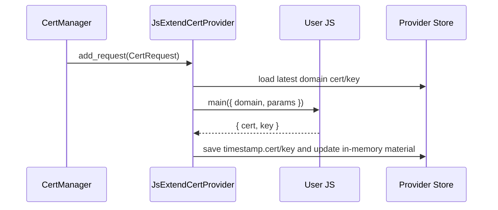

# cert-manager 设计

> 本文件只记录 v0.6 证书管理统一入口的实现设计。涉及 Rust 代码的章节遵守 `harness/rules/design-doc-rules.md` 和 `harness/rules/rust-design-doc-rules.md`。

## 元数据
- version: v0.6
- module: cert-manager
- stage: design
- status: approved

## 目标与非目标
### 目标
- 在 `cyfs-acme` 内实现统一 `CertManager`，管理所有证书 provider。
- 定义 `CertProvider` 的最小统一接口：添加证书管理请求、消费服务端证书、消费客户端证书、查询状态。
- 保留现有 ACME 申请执行路径：account、单 issuer、challenge、keystore、续期和已有证书装载仍由每个 ACME provider 内部负责。
- 新增 `cert_providers` 配置作为需要申请生命周期的证书 provider 定义入口；多个 ACME issuer 通过多个 ACME provider 表达。
- `cert_providers` 支持 `type=js_extend` 的通用脚本 provider；不同证书申请逻辑通过不同 JS 脚本实现，Rust 侧只负责脚本执行、证书解析、落盘、定时刷新和 provider 边界。
- 保留旧格式兼容入口：`cert_providers` 可缺省，gateway 可创建 `id=default` 的默认 ACME provider；TLS / QUIC 证书条目未设置 `cert_provider` 但设置 `acme_type` 时绑定该默认 provider。
- 保留本地静态证书、tunnel local 证书和 self-signed fallback 的现有消费路径，但它们不作为 provider 接入 `CertManager`。
- 明确 TLS / QUIC server 证书和 tunnel client 证书如何通过统一入口消费。

### 非目标
- 不抽象跨 provider 的统一 order、challenge、solver 或续期状态机。
- 不把 DNS provider、HTTP-01 server、TLS-ALPN cache 提升为证书 provider。
- 不迁移现有 ACME keystore、自签证书目录、静态证书文件或 tunnel local 证书文件。
- 不新增 `cert/` 目录。
- 不把本地静态证书、tunnel local 证书或 self-signed fallback 建模为 provider。
- 不继续保留 `AcmeCertManager` 内部多 issuer 模型；原 named issuer 配置不再作为目标配置语义。

## 总体方案
第一阶段将统一内核放在 `cyfs-acme` crate。`CertManager` 负责注册 provider、接收配置翻译出的 `CertRequest`、按 provider 路由证书消费请求并聚合状态。证书如何申请、续期、challenge、装载已有证书、缓存和落盘都属于 provider 内部实现。

`cert_providers` 是证书申请 provider 定义入口。每个 provider 都有独立 id 和 type；多个 ACME issuer 不再由单个 `AcmeCertManager` 的 issuer map 表达，而是配置成多个 `type=acme` provider。通用 JS 证书申请逻辑配置成 `type=js_extend` provider，脚本承担具体 CA / 平台交互，Rust 侧承担统一执行、落盘、解析和定时刷新。证书请求只引用 provider id，不再携带 issuer 选择。ACME DNS-01 provider registry 继续使用现有 `acme.dns_providers` / `acme.dns_provider_path` 格式，不搬进 `cert_providers`。

`CertProvider` 只提供统一边界：
- `add_request(CertRequest)`：添加或更新 provider 名下的证书管理请求。
- `resolve_server_cert(ServerCertQuery)`：消费服务端证书，返回 `Arc<CertifiedKey>` 或 not-ready / not-found。
- `resolve_client_cert(ClientCertQuery)`：消费客户端证书，返回 provider-neutral `ClientCertMaterial`。
- `list_statuses()` / `get_status()`：返回控制面状态快照，不暴露 private key。

provider 选择必须显式且稳定。请求绑定到某个 ACME provider 就只能消费该 provider 的结果。`CertManager` 不做跨 provider fallback，也不回退到本地静态证书或 self-signed fallback。

## 模块拆解
| 子模块 | 归属 | 职责 | 边界 |
|--------|------|------|------|
| unified-cert-core | `src/components/cyfs-acme/` | 定义 `CertRequest`、query、material、status、`CertProvider` 和 `CertManager` | 只做统一入口和路由，不实现具体签发流程 |
| acme-provider | `src/components/cyfs-acme/` | 将单 issuer `AcmeCertManager` 适配为 `CertProvider` | 每个 ACME provider 拥有独立 account、issuer、challenge、keystore、续期和已有证书装载 |
| js_extend_cert_provider | `src/components/cyfs-acme/` | 执行用户 JS 脚本获取/更新证书，解析输出并保存到 provider-owned store | 不内置第三方 CA 逻辑，不跨 provider 读取或回退；详细设计见 `js_extend_cert_provider/design.md` |
| server-cert-consumer | `src/components/cyfs-gateway-lib/src/stack/` | TLS / QUIC 通过 `CertManager` 消费动态 ACME 服务端证书 | 静态证书仍由本地 SNI map 持有；self-signed fallback 仍由 `SelfCertMgr` 本地处理 |
| tunnel-client-cert-consumer | `src/components/cyfs-gateway-lib/src/tunnel_client_cert_manager.rs` | tunnel client 通过 `CertManager` 消费 ACME 客户端证书 | local 类型仍由 tunnel snapshot 自己持有 |
| gateway-wiring | `src/apps/cyfs_gateway/src/` | 从 `cert_providers` 创建 provider runtime、创建 `CertManager` 并注册 provider | reload 失败不得提交半更新证书状态 |

## 子模块设计索引
| 文档 | 子模块 | 范围 |
|------|--------|------|
| `js_extend_cert_provider/design.md` | js_extend_cert_provider | `type=js_extend` 配置契约、脚本调用契约、provider-owned store、运行时状态、错误处理、并发与测试映射 |

## 实现顺序
| 阶段 | 目标 | 输出 |
|------|------|------|
| 1 | 在 `cyfs-acme` 定义统一类型和 `CertProvider` trait | `cert_types.rs`，`lib.rs` re-export |
| 2 | 在 `cyfs-acme` 实现 `CertManager` 和 `AcmeProvider` adapter | `cert_mgr.rs` 中新增统一入口，不重写 ACME 状态机 |
| 3 | 在 `cyfs-acme` 实现 `JsExtendCertProvider` | 脚本执行、证书输出解析、落盘、状态与定时刷新；细节见 `js_extend_cert_provider/design.md` |
| 4 | 改造 TLS / QUIC / tunnel consumer 的动态证书消费路径 | stack 与 tunnel manager 通过 `CertManager` 查询 provider |
| 5 | 改造 gateway create / reload 装配 | 解析 `cert_providers`，创建 provider runtime，配置引用翻译为 `CertRequest` 后提交给 `CertManager` |

## 关键决策
- 统一的是管理入口和消费入口，不统一具体证书获取流程。
- `CertManager` 不持有 provider 私钥文件，不扫描 provider 私有目录，不创建统一证书池。
- ACME provider 必须优先适配现有 `AcmeCertManager::add_acme_item`、`CertStub::load_cert`、challenge responder 和续期任务，但每个 provider 只承载一个 issuer。
- 多个 ACME issuer 通过多个 `type=acme` provider 表达，而不是通过单个 ACME manager 的 named issuer map 表达。
- self-signed 自动生成不是 provider 行为；只在配置声明 `domain: "*"` 时由 TLS / QUIC 本地 resolver 通过 `SelfCertMgr` 处理。
- 静态 server 证书、self-signed fallback 和 tunnel local 证书第一阶段都不是 lifecycle provider；它们继续由 consumer-local snapshot / SNI map / `SelfCertMgr` 持有。

## 接口与依赖
### 统一接口
| 接口 | 用途 | 说明 |
|------|------|------|
| `CertManager::register_provider` | 注册 provider | provider id 必须唯一 |
| `CertManager::add_request` | 添加证书管理请求 | 按 `(usage, identifier, provider)` 去重后路由到 provider |
| `CertManager::resolve_server_cert` | 服务端证书消费 | 用于 TLS / QUIC，返回 `Arc<CertifiedKey>` |
| `CertManager::resolve_client_cert` | 客户端证书消费 | 用于 tunnel client，返回 `ClientCertMaterial` |
| `CertManager::list_statuses` / `get_status` | 控制面状态 | 只返回 status、source、expires、last_error 等元数据 |

### `cert_providers` 配置
`cert_providers` 定义 gateway 内需要申请生命周期的证书 provider。每个条目必须有稳定 id 和 type；动态证书消费配置只引用 provider id。ACME DNS challenge provider 的注册配置保持现有 `acme` 段格式。

示例结构：

```yaml
acme:
  dns_providers:
    aliyun:
      accessKeyId: "***"
      accessKeySecret: "***"
    sn-dns:
      sn: https://sn.buckyos.ai
      key_path: ***
      device_config_path: ***

cert_providers:
  letsencrypt-prod:
    type: acme
    account_path: data/acme/letsencrypt-prod/account.json
    directory_url: https://acme-v02.api.letsencrypt.org/directory
    keystore_path: data/acme/letsencrypt-prod/certs
    check_interval: 3600
    renew_before_expiry: 2592000

  letsencrypt-staging:
    type: acme
    account_path: data/acme/letsencrypt-staging/account.json
    directory_url: https://acme-staging-v02.api.letsencrypt.org/directory
    keystore_path: data/acme/letsencrypt-staging/certs

  custom-js:
    type: js_extend
    script_name: my-ca
    # or: script_path: ./scripts/my-ca.js
    check_interval: 43200
    renew_before_expiry: 2592000
    params:
      endpoint: https://ca.example.com
      token: "***"
```

配置规则：
- `cert_providers` 是可选配置。缺省时不应阻止旧格式 `acme` + `stacks[].certs[].acme_type` 的动态证书配置继续工作。
- gateway 必须保留兼容默认 ACME provider，provider id 固定为 `default`。该 provider 由顶层 `acme` 配置与 ACME provider 默认值共同构造，不要求用户在 `cert_providers` 中声明。
- 如果 `cert_providers` 中显式声明了 `default`，该声明就是默认 provider 的配置来源；gateway 不得再创建第二个同名 provider。
- `type=acme` 的 provider 配置只包含一个 issuer；旧的 default issuer + named issuers map 不再作为目标模型。
- `type=js_extend` 的 provider 必须配置 `script_path` 或 `script_name` 二者之一；`script_path` 直接指向 JS 文件，`script_name` 从固定目录 `cyfs_gateway/cert_provider/<script_name>` 装载脚本包，包格式与 `acme_dns_provider` 一致。
- `type=js_extend` provider 不接受用户配置 `store_path`；store 根目录按 ACME provider 的证书目录规则派生：`default` provider 使用 `cyfs_gateway` 数据目录下的 `certs`，非 `default` provider 使用 `cyfs_gateway` 数据目录下的 `certs/<provider-id>`。
- `type=js_extend` provider 的 `params` 原样传给脚本；Rust-JS 接口不暴露 provider id、usage、store 路径或 request 原始结构。
- 需要多个 ACME CA、环境或 challenge 策略时，配置多个 `type=acme` provider。
- ACME DNS-01 provider 凭据、`js_extend_cert_provider` path 和 SN DNS provider 参数继续放在现有 `acme.dns_providers` / `acme.dns_provider_path` 下。
- `cert_providers.<id>` 不保存 DNS provider 凭据；DNS-01 request 只通过 provider request data 引用 `acme.dns_providers` 中的 provider name。
- `stacks[].certs[]` 中动态证书条目显式引用 `cert_provider` 时，翻译为 `CertRequest(provider=<id>, usage=server)` 并只消费该 provider。
- `stacks[].certs[]` 中动态证书条目未设置 `cert_provider` 但设置了 `acme_type` 时，翻译为 `CertRequest(provider=default, usage=server)`，用于兼容旧 TLS / QUIC 配置格式。
- `stacks[].certs[]` 中 `domain: "*"` 不引用 `cert_provider`；它继续表示本地 self-signed fallback，由 `SelfCertMgr` 消费。
- `tunnel_client_certs.type=acme` 必须引用 `cert_provider`，再翻译为 `CertRequest(provider=<id>, usage=tunnel-client)`。
- `tunnel_client_certs.type=local` 不提交给 `CertManager`。
- `tls_ca` 保持为 self-signed fallback 的本地配置入口，不放入 `cert_providers`。

## 接入现有模块方案
### `cyfs-acme` 接入
- `src/components/cyfs-acme/src/cert_types.rs` 新增统一类型和 `CertProvider` trait，作为 `cyfs-acme` 对外暴露的 provider-neutral API。
- `src/components/cyfs-acme/src/cert_mgr.rs` 保留现有 `AcmeCertManager`、`AcmeItem`、`CertStub`、DNS provider registry、challenge cache 和 renewal task；新增 `CertManager` 与 `AcmeProvider` adapter。
- `AcmeProvider` 由单个 `cert_providers.<id>` 创建，并持有一个单 issuer `AcmeCertManagerRef`；旧的 named issuer map 不再进入 provider runtime。
- `CertManagerConfig` 的目标形态是单 issuer 配置；现有 default issuer / named issuers 字段应在 implementation 中删除，配置输入中出现 named issuers 必须报错。
- `CertManagerConfig.dns_providers` / `dns_provider_path` 继续从顶层 `acme` 段灌入；多个 ACME provider 可以共享同一套 DNS provider registry 配置。
- `AcmeProvider::add_request` 只把 `CertRequest(provider=<acme-provider-id>)` 翻译成现有 `AcmeItem` 并调用 `AcmeCertManager::add_acme_item`。
- `AcmeProvider::resolve_server_cert` 复用现有 ACME server cert resolver 或 `CertStub::get_cert`，不新建证书读取路径。
- `AcmeProvider::resolve_client_cert` 复用 `CertStub::get_material()`，只做 `ClientCertMaterial` 转换。
- `src/components/cyfs-acme/src/js_extend_cert_provider.rs` 新增 `JsExtendCertProvider`，执行用户 JS 脚本获取或更新证书，并把脚本输出校验后保存到 provider 自己的 store。
- `JsExtendCertProvider::add_request` 为每个 domain 建立 provider-owned stub，启动异步装载；缺少证书或证书接近续期窗口时调用脚本。
- `JsExtendCertProvider` 不实现 ACME challenge、HTTP-01 token 或 DNS provider factory；这些仍属于 ACME provider 内部路径。
- `src/components/cyfs-acme/src/lib.rs` re-export `CertManager`、`CertProvider`、`CertRequest`、query、material 和 status 类型。

### `cyfs-gateway-lib` 接入
- 不新增 `SelfSignedProvider`，不把本地证书或 self-signed fallback 注册到 `CertManager`。
- `src/components/cyfs-gateway-lib/src/self_cert_mgr.rs` 保持本地 CA、leaf cert store 和 cache 现有职责，继续服务 TLS / QUIC fallback。
- `src/components/cyfs-gateway-lib/src/stack/tls_cert_resolver.rs` 保留静态 SNI map 和 self-signed fallback；只有动态 ACME 解析改为构造 `ServerCertQuery` 并调用 `CertManager::resolve_server_cert`。
- `src/components/cyfs-gateway-lib/src/stack/tls_stack.rs` 和 `quic_stack.rs` 的 stack context 从直接持有 `AcmeCertManagerRef` 逐步迁移为持有 `CertManagerRef`；`SelfCertMgrRef` 仍作为本地 fallback 字段保留。
- `src/components/cyfs-gateway-lib/src/tunnel_client_cert_manager.rs` 保留 local snapshot 逻辑；`type=acme` 的 alias 解析改为构造 `ClientCertQuery` 并调用 `CertManager::resolve_client_cert`。
- `src/components/cyfs-gateway-lib/src/server/acme_http_challenge_server.rs` 继续直接依赖 `AcmeCertManagerRef`，不通过 `CertManager`，避免 HTTP-01 token path 被通用证书消费接口污染。

### `cyfs_gateway` app 接入
- `src/apps/cyfs_gateway/src/config_loader.rs` 解析 `cert_providers`，保留现有 `acme.dns_providers` 解析逻辑，支持 `type=acme` 与 `type=js_extend`，并拒绝 ACME provider 内部出现 named issuers 配置。
- `src/apps/cyfs_gateway/src/gateway.rs` 按 `cert_providers` 遍历创建 provider runtime：每个 `type=acme` 创建一个单 issuer `AcmeCertManagerRef`，每个 `type=js_extend` 创建一个 `JsExtendCertProvider`；当 `cert_providers` 缺省或旧格式动态证书需要 ACME provider 时，创建兼容 provider `default`。
- gateway 仍按现有 `tls_ca` 创建 `SelfCertMgrRef`，但不注册到 `CertManager`。
- gateway 创建 `CertManager` 后按 provider id 注册 `AcmeProvider`。
- gateway 增加配置翻译步骤，把 `stacks[].certs[]` 和 `tunnel_client_certs` 中需要 provider 管理的条目转换为带显式 provider id 的 `CertRequest` 并提交给 `CertManager`。
- gateway / stack 翻译不得依赖“只有一个 provider 时可省略 provider”的隐式推断来表达旧格式兼容；旧 TLS / QUIC `acme_type` 条目必须在进入 `CertManager` 前归一化到 `provider=default`。
- gateway 将 `CertManagerRef` 注入 TLS / QUIC stack context 和 `TunnelClientCertManager::prepare_reload`。
- `src/apps/cyfs_gateway/src/acme_sn_provider.rs` 继续作为 ACME DNS-01 provider factory 注册到每个 ACME provider runtime 使用的 `AcmeCertManager`，不注册到 `CertManager`。
- reload 采用新 `CertManager` 组装新 context；只有 stack / server / tunnel prepared snapshot 全部成功后才提交。

### 接入过渡约束
- 第一阶段允许旧 resolver 与新 `CertManager` adapter 短期并存，但同一条动态证书请求只能有一个权威消费路径。
- 新代码不得从 TLS / QUIC / tunnel consumer 直接调用 `AcmeCertManager::add_acme_item`；动态证书请求必须先进入 `CertManager::add_request`。
- ACME HTTP-01 challenge、DNS-01 provider factory、TLS-ALPN challenge cache 仍是 ACME 内部路径，不迁移到 `CertManager`。
- 如果某个现有调用点还不能迁移，必须在实现中保留明确 TODO 和测试覆盖，避免出现同一证书同时由旧路径和新路径注册。

## Rust 类型与接口设计
| 类型 / 接口 | 路径 | 可见性 | 职责 | 输入 | 输出 | 错误 | 所有权 / 生命周期 |
|-------------|------|--------|------|------|------|------|-------------------|
| `CertUsage` | `src/components/cyfs-acme/src/cert_types.rs` | `pub enum` | 区分 `server`、`tunnel-client` 等用途 | 配置翻译结果 | usage tag | 无独立错误 | clone value |
| `CertProviderId` | `src/components/cyfs-acme/src/cert_types.rs` | `pub struct` 或 `pub enum` | 标记 provider 身份 | `cert_providers` 中的 provider id | provider key | 非法 provider name | request、query、status 均携带 |
| `CertIdentifier` | `src/components/cyfs-acme/src/cert_types.rs` | `pub enum` | 表示证书 identifier，第一阶段只实现 DNS | domain | identifier | unsupported identifier | `CertRequest` 持有 |
| `CertRequest` | `src/components/cyfs-acme/src/cert_types.rs` | `pub struct` | provider-neutral 管理请求 | usage、provider、identifier、provider request data | request id 或 `()` | invalid request、unsupported provider | `CertManager` request index 持有；issuer 来自 provider config |
| `ServerCertQuery` | `src/components/cyfs-acme/src/cert_types.rs` | `pub struct` | 服务端证书消费查询 | provider、SNI/domain、ALPN、stack id | query key | unknown request、not ready | TLS / QUIC resolver 构造 |
| `ClientCertQuery` | `src/components/cyfs-acme/src/cert_types.rs` | `pub struct` | 客户端证书消费查询 | provider、alias、domain | query key | unknown alias、not ready | tunnel manager 构造 |
| `ClientCertMaterial` | `src/components/cyfs-acme/src/cert_types.rs` | `pub struct` | provider-neutral 客户端证书材料 | provider 输出 | cert chain、private key、expires、source | material parse / mismatch | gateway-lib 转换为 `TunnelClientCertMaterial` |
| `CertSource` | `src/components/cyfs-acme/src/cert_types.rs` | `pub enum` | 标记 provider 证书来源 | ACME keystore、后续 provider-owned store | source tag | 无独立错误 | 只用于 provider 状态和审计，不覆盖本地证书 |
| `CertStatus` | `src/components/cyfs-acme/src/cert_types.rs` | `pub enum` | 控制面状态 | provider 内部状态 | pending、ready、renewing、expired、failed、not-found | 无独立错误 | snapshot value |
| `CertStatusSnapshot` | `src/components/cyfs-acme/src/cert_types.rs` | `pub struct` | provider 状态快照 | provider 状态 | provider、source、status、expires、last_error | 无独立错误 | 不包含 private key |
| `CertProvider` | `src/components/cyfs-acme/src/cert_types.rs` | `pub trait` | provider 统一接口 | request / query | `()`、`CertifiedKey`、`ClientCertMaterial`、status | `CertError` / adapter error | object-safe，`Arc<dyn CertProvider + Send + Sync>` |
| `CertManager` | `src/components/cyfs-acme/src/cert_mgr.rs` | `pub struct` | 统一管理和消费入口 | provider registry、request index、query | 路由后的消费结果和状态 | provider conflict、not ready、material mismatch | gateway 持有 `Arc` |
| `AcmeProvider` | `src/components/cyfs-acme/src/cert_mgr.rs` | `pub struct` | 适配单 issuer `AcmeCertManager` | `CertRequest(provider=<acme-provider-id>)`、query | ACME material / status | ACME error 映射 | 持有 `AcmeCertManagerRef` |
| `CertProvidersConfig` | `src/apps/cyfs_gateway/src/config_loader.rs` | `pub struct` | 顶层 `cert_providers` 配置 | provider id map | provider config map | duplicate / invalid provider id | gateway create / reload 输入 |
| `CertProviderConfig` | `src/apps/cyfs_gateway/src/config_loader.rs` | `pub enum` | 区分 provider 类型 | `type` tag | 第一阶段只接受 `AcmeProviderConfig` | unknown provider type | 反序列化后不可丢失 id |
| `AcmeProviderConfig` | `src/apps/cyfs_gateway/src/config_loader.rs` | `pub struct` | 单 issuer ACME provider 配置 | account、directory、keystore、renew policy | `CertManagerConfig` | named issuers 出现时报错 | 每个 config 创建一个 `AcmeCertManagerRef`；DNS provider registry 来自 `acme` 段 |
| `JsExtendCertProviderConfig` | `src/apps/cyfs_gateway/src/config_loader.rs` | `pub struct` | `js_extend_cert_provider` 配置 | script_path 或 script_name、renew policy、params | `JsExtendCertProviderConfig` | 脚本来源缺失或冲突、配置中出现 `store_path`、脚本执行失败、证书材料非法 | 每个 config 创建一个 `JsExtendCertProvider`，并持有自己的定时检查任务 |
| `JsExtendCertProvider` | `src/components/cyfs-acme/src/js_extend_cert_provider.rs` | `pub struct` | 执行用户 JS 脚本获取/更新证书 | `CertRequest`、provider params、按 provider id 派生的 store root | server/client material、status | 脚本错误、输出缺字段、证书私钥不匹配、证书过期 | provider 拥有请求索引、状态、store 和定时任务 |

`CertProvider` trait 必须保持对象安全，不暴露泛型生命周期参数。provider 内部可以使用任意状态机，但不能要求 `CertManager` 理解 provider-specific order 或 challenge。

## 主要流程调用逻辑
### 请求提交与证书消费


规则：
- `CertManager` 只按 provider id 路由，不参与申请状态机。
- request 与 query 的 provider 必须一致。
- ACME not-ready 不能回退到 self-signed。
- self-signed 只在 TLS / QUIC 本地 resolver 命中显式 `domain: "*"` 配置时参与服务端证书解析，不经过 `CertManager`。

### Gateway 启动 / reload 装配


规则：
- reload 使用新的 `CertManager` 和 provider adapter 组装新 context。
- tunnel prepared snapshot 只有在 stack / server 准备成功后才 commit。
- reload 失败时丢弃 prepared snapshot，旧 manager 继续由旧 context 持有。

### ACME provider 内部路径


规则：
- 不重写 `AcmeClient`、`AcmeOrderSession::start`、`DefaultChallengeResponder` 或 DNS provider factory。
- HTTP-01 仍由 `AcmeHttpChallengeServer` 通过 `AcmeCertManager::get_auth_of_token` 暴露。
- DNS-01、TLS-ALPN-01 都保留在 ACME provider 内部路径。

### js_extend_cert_provider 内部路径
详细契约和子模块内部设计见 `js_extend_cert_provider/design.md`。本节只保留主模块视角下的跨模块调用摘要。



规则：
- JS 脚本入口是 `export async function main(argv)`，第一个参数是 JSON object，固定只包含 `domain` 和 `params`。
- Rust-JS 接口不传入 `op`、`provider`、`usage`、`derived_store_path` 或 `request` 字段；这些属于 Rust 侧 provider runtime 内部状态。
- 脚本固定返回 `{ cert, key }`，Rust 侧负责校验证书链与私钥并落盘到 provider store；不支持 `fullchain` / `private_key` 或 `cert_path` / `key_path` 别名。
- provider 启动和定时检查时会读取 store 中最新的证书；接近 `renew_before_expiry` 或缺失证书时调用脚本。
- 脚本失败时保留旧的 ready/renewing 证书材料，状态记录 `last_error`，不得回退到其他 provider。

## 已有证书保留与消费
| 来源 | 保留策略 | 消费方式 |
|------|----------|----------|
| ACME | 每个 ACME provider 使用自己的 `keystore_path/<domain>/timestamp.cert|key`，由 `CertStub::load_cert()` 装载 | 对应 `AcmeProvider` 通过自己的 `AcmeCertManager` / `CertStub` 返回 server 或 client material |
| js_extend_cert_provider | 每个 `js_extend_cert_provider` 使用按 ACME provider 规则派生出的 provider store root，并在其下使用 `<domain>/timestamp.cert|key`，脚本输出由 provider 校验后写入；详细规则见 `js_extend_cert_provider/design.md` | 对应 `JsExtendCertProvider` 返回 server 或 client material |
| self-signed | 继续使用 `SelfCertMgr.store_path`、CA 文件和 cache | TLS / QUIC 本地 resolver 调用 `SelfCertMgr` 按需生成或读取，不进入 provider 生命周期 |
| server static cert | 继续由 `stacks[].certs[].cert_path/key_path` 指向用户文件 | 由 stack 本地 SNI map 消费，不进入 provider 生命周期 |
| tunnel local cert | 继续由 `TunnelClientCertManager` snapshot 持有 | `resolve_material(alias)` 直接返回 local material，不进入 provider 生命周期 |

## 错误处理与生命周期边界
- `CertError` 至少区分 invalid request、unsupported provider、unsupported identifier、provider conflict、not ready、not found、expired、provider failed、material mismatch。
- `CertManager::add_request` 对 provider 未注册、request 冲突或 provider 拒绝必须返回错误。
- `resolve_*` 对未 ready 证书返回 not-ready，不触发跨 provider fallback。
- 控制面状态接口不得返回 private key。
- `CertManager` 不启动 provider 续期任务；ACME 定时检查由 `AcmeCertManager::create` 启动并在 drop 时 abort，`js_extend_cert_provider` 定时检查由 `JsExtendCertProvider` 自己启动并在 drop 时 abort。
- `CertManager` drop 只释放 provider adapter 引用；provider 底层 runtime 按各自 `Arc` 生命周期释放。
- reload 失败不得提交新 tunnel snapshot 或替换旧 stack context。

## 并发、异步与资源所有权
- `CertManager` 以 `Arc` 注入 gateway、stack 和 tunnel manager。
- provider registry 与 request index 使用锁保护；锁内只做查表和 clone provider，不执行长耗时签发流程。
- provider 拥有各自状态：每个 ACME provider 拥有自己的 account、单 issuer、challenge cache、keystore 和 renewal task；每个 `js_extend_cert_provider` 拥有自己的脚本配置、store、请求状态和 renewal task；self-signed 的 CA、store path 和 cache 归 `SelfCertMgr` 本地 resolver 路径。
- ACME DNS-01 provider registry 配置来自现有 `acme` 段；各 ACME provider runtime 可以装载同一份 DNS provider registry，但 DNS provider 本身不是 certificate provider。
- private key 只由 provider 或 consumer runtime material 持有，不进入普通状态结构。
- ACME order、challenge cleanup、DNS 调用和 renewal 并发仍使用现有 `AcmeCertManager` / `CertStub` 机制。

## 配置、依赖注入与测试替身边界
- gateway 配置解析后新增 `cert_providers` 装载和请求翻译层，同时保留现有 `acme.dns_providers` 装载，把 `stacks[].certs[]` 和 `tunnel_client_certs` 转成带 provider id 的 `CertRequest`。
- `AcmeProvider` 注入从单个 ACME provider config 创建的 `AcmeCertManagerRef`，测试可使用 fake ACME provider 或临时 keystore。
- `JsExtendCertProvider` 注入脚本来源、按 ACME provider 规则派生的 store root、检查周期、续期提前量和 provider params；测试使用临时脚本与临时 store，不依赖真实外部 CA；脚本接口固定为 `{ domain, params } -> { cert, key }`，子模块契约见 `js_extend_cert_provider/design.md`。
- `SelfCertMgr` 继续从 `tls_ca` 创建，测试使用临时 store path；它不是 `CertProvider` 测试替身。
- DNS-01 测试替身仍通过现有 `acme.dns_providers` / ACME 内部 `DnsProviderFactory` 注入，不经过 `CertProvider` trait。
- tunnel client cert 测试需要覆盖 local material 仍不进入 `CertManager`、ACME material 通过 `CertManager` 消费。

## 实现布局
```text
src/components/cyfs-acme/src/
├── acme_client.rs
├── cert_mgr.rs
├── js_extend_cert_provider.rs
├── default_challenge_responder.rs
└── lib.rs

src/components/cyfs-gateway-lib/src/
├── self_cert_mgr.rs
├── tunnel_client_cert_manager.rs
├── server/
│   └── acme_http_challenge_server.rs
└── stack/
    ├── quic_stack.rs
    ├── tls_cert_resolver.rs
    └── tls_stack.rs

src/apps/cyfs_gateway/src/
├── acme_sn_provider.rs
├── config_loader.rs
└── gateway.rs
```

| 路径 | 新增 / 修改 | 职责 | 导出关系 | 测试归属 |
|------|-------------|------|----------|----------|
| `src/components/cyfs-acme/src/cert_types.rs` | 新增 | 统一类型、query、material、status、`CertProvider` trait | `lib.rs` re-export | unit |
| `src/components/cyfs-acme/src/cert_mgr.rs` | 修改 | 保留现有 ACME manager，并新增 `CertManager` / `AcmeProvider` | `lib.rs` re-export | unit + DV |
| `src/components/cyfs-acme/src/js_extend_cert_provider.rs` | 新增 | `js_extend_cert_provider`，负责脚本调用、证书解析、落盘、定时刷新和状态；详细设计见 `js_extend_cert_provider/design.md` | `lib.rs` re-export | unit |
| `src/components/cyfs-acme/src/lib.rs` | 修改 | 导出统一证书管理 API | crate public API | compile |
| `src/components/cyfs-gateway-lib/src/self_cert_mgr.rs` | 不改或最小修改 | 继续提供本地 self-signed fallback，不实现 `CertProvider` | gateway-lib 内部 / re-export | DV |
| `src/components/cyfs-gateway-lib/src/tunnel_client_cert_manager.rs` | 修改 | ACME client cert 改为通过 `CertManager` 消费 | gateway 使用 | unit + integration |
| `src/components/cyfs-gateway-lib/src/stack/tls_cert_resolver.rs` | 修改 | 动态证书解析通过 `CertManager` 路由 | stack 内部 | unit |
| `src/components/cyfs-gateway-lib/src/stack/tls_stack.rs` | 修改 | 注入 `CertManager` 到 TLS cert resolver | stack factory | DV |
| `src/components/cyfs-gateway-lib/src/stack/quic_stack.rs` | 修改 | 注入 `CertManager` 到 QUIC cert resolver | stack factory | DV |
| `src/components/cyfs-gateway-lib/src/server/acme_http_challenge_server.rs` | 不改或最小修改 | HTTP-01 继续直接使用 `AcmeCertManagerRef` | server factory | DV |
| `src/apps/cyfs_gateway/src/gateway.rs` | 修改 | 从 `cert_providers` 创建 provider runtime、注册 provider、提交 request、处理 reload | app 内部 | DV + integration |
| `src/apps/cyfs_gateway/src/config_loader.rs` | 修改 | 解析 `cert_providers`，保留现有 `acme.dns_providers` 解析，并校验 provider id / type / 单 issuer ACME 配置 | app 内部 | unit |
| `src/apps/cyfs_gateway/src/acme_sn_provider.rs` | 不改或最小修改 | DNS-01 provider factory 继续注册到 ACME provider runtime 使用的 `AcmeCertManager` | app 内部 | DV |

## 实现准入映射
| Proposal 条目 ID | Design 覆盖 | 相关路径或接口 | 仍需补 design 的情况 |
|------------------|-------------|----------------|----------------------|
| `P-cert-1` | 模块拆解、接入现有模块方案、实现布局 | `cyfs-acme`、`cyfs-gateway-lib`、`gateway.rs`、`config_loader.rs` | 改变 crate 归属、目录结构或配置语义 |
| `P-cert-2` | `CertManager` / `CertProvider` 接口、主要流程 | `CertRequest`、query、material、status、provider adapters | 新增 provider、抽象统一 order/challenge/solver |
| `P-cert-3` | 接入现有模块方案、已有证书保留与消费 | ACME keystore、self-signed store、static/local consumer | 引入共享证书池、跨 provider fallback 或 private key 状态暴露 |
| `P-cert-5` / `P-cert-js-extend-*` | `js_extend_cert_provider` 配置、内部路径、类型接口、实现布局；详细子模块 design 见 `js_extend_cert_provider/design.md`，proposal 见 `js_extend_cert_provider/proposal.md` | `JsExtendCertProviderConfig`、`JsExtendCertProvider`、`script_path` / `script_name`、`{ domain, params } -> { cert, key }` 脚本接口、按 provider id 派生的 provider store | 新增脚本外的第三方 CA Rust provider、改变脚本调用契约、允许用户配置 store path 或引入跨 provider fallback |

## 风险与回滚
- 最大风险是统一入口误变成第二套证书生命周期状态机；实现时必须限制 `CertManager` 只做路由和状态聚合。
- provider 身份在 `cert_providers` 解析、配置翻译、request index 或 query 中丢失会导致跨 provider 混用。
- reload 半提交会导致 tunnel cert snapshot 与 stack context 不一致。
- 回滚优先恢复现有 `AcmeCertManager`、`SelfCertMgr`、TLS resolver 和 tunnel manager 直接组合路径。
