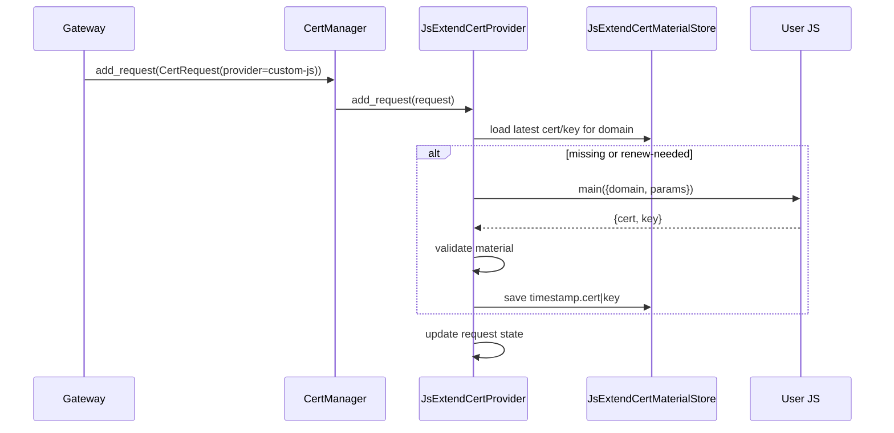
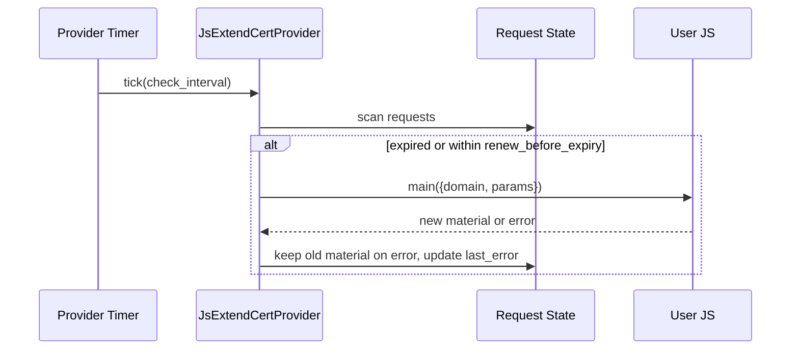

# js_extend_cert_provider 子模块设计

## 元数据
- version: v0.6
- module: cert-manager
- submodule: js_extend_cert_provider
- stage: design
- status: approved

## 设计来源
- Proposal 条目：`js_extend_cert_provider/proposal.md` 中 `P-cert-js-extend-*`
- 主设计入口：`docs/versions/v0.6/modules/cert-manager/design.md`
- 测试映射：`js_extend_cert_provider/testing.md`，以及 `docs/versions/v0.6/modules/cert-manager/testing.md` 中 `js_extend_cert_provider-runtime`、`cert_providers.type=js_extend`、`test_js_extend_cert_provider_*`、`test_parse_js_extend_cert_provider_config`

## 职责
`js_extend_cert_provider` 是 `cert-manager` 下的独立 lifecycle provider 子模块。它负责把 `cert_providers.<id>.type=js_extend` 配置转换为一个 provider-owned runtime，通过用户 JS 脚本获取或更新证书，并把校验后的证书材料保存到按 provider id 派生的证书目录。

子模块职责：
- 装载 JS 脚本来源：直接 `script_path` 或固定目录下的 `script_name` 包。
- 接收 `CertRequest`，为每个 domain / usage 建立 provider-owned request state。
- 从 provider store 装载最新证书，缺失、过期或接近续期窗口时调用脚本。
- 解析脚本输出，校验证书链、私钥匹配和过期时间。
- 写入 provider-owned 证书目录下的 `<domain>/timestamp.cert|key`，并更新内存材料与状态。
- 为 `CertProvider` trait 暴露 server cert、client cert 和 status 查询。

子模块不负责：
- ACME account、order、challenge、HTTP-01、DNS-01 或 TLS-ALPN-01。
- DNS provider factory、SN DNS provider 或 `acme.dns_providers` 装载。
- 跨 provider fallback 或读取其他 provider 的 store。
- 本地静态证书、self-signed fallback 或 tunnel local 证书。

## 配置契约
`cert_providers.<id>.type=js_extend` 支持以下字段：

| 字段 | 必填 | 语义 | 默认值 / 约束 |
|------|------|------|---------------|
| `type` | 是 | provider 类型，固定为 `js_extend` | 无 |
| `script_path` | 二选一 | 直接指向 JS 文件 | 相对路径按 gateway 主配置文件目录解析 |
| `script_name` | 二选一 | 从固定 JS 包目录装载脚本包 | 根目录为 `cyfs_gateway/cert_provider/<script_name>` |
| `check_interval` | 否 | 定时检查间隔，秒 | 与 cert-manager 默认检查间隔一致 |
| `renew_before_expiry` | 否 | 提前续期窗口，秒 | 与 cert-manager 默认续期窗口一致 |
| `params` | 否 | provider 级脚本参数 | 原样传给脚本，不写入状态输出 |
| `params_path` | 否 | provider 级脚本参数文件 | JSON / YAML object；相对路径按 gateway 主配置文件目录解析；与 `params` 二选一 |

配置校验规则：
- `script_path` 与 `script_name` 必须且只能配置一个。
- `params` 与 `params_path` 不能同时配置；`params_path` 文件内容必须解析为 JSON object。
- `script_path` 不经过 ACME DNS provider package 目录解析。
- `script_name` 使用与 JS package manager 兼容的包结构，但包目录归 `cert_provider`，不复用 `acme_dns_provider` 作为证书 provider 根目录。
- `store_path` 不允许出现在 `type=js_extend` 配置中；provider store 路径由 gateway 按 ACME provider 证书目录规则派生。
- provider store 根目录规则与 ACME provider 一致：`default` provider 使用 `cyfs_gateway` 数据目录下的 `certs`，非 `default` provider 使用 `cyfs_gateway` 数据目录下的 `certs/<provider-id>`。
- 脚本接口只接收 Rust 侧整理后的最小申请上下文和 provider 级 `params`；不传入 provider id、usage、派生 store 路径或 `CertRequest` 原始结构。

示例：

```yaml
cert_providers:
  custom-js:
    type: js_extend
    script_name: my-ca
    check_interval: 43200
    renew_before_expiry: 2592000
    params:
      endpoint: https://ca.example.com
      token: "***"

cert_providers:
  step-jwk:
    type: js_extend
    script_name: step_jwk
    params_path: ./cert_provider/step_jwk/params.yaml
```

## 脚本调用契约
`js_extend_cert_provider` 的脚本入口为 package manager 可执行的 `main` 函数。Rust 侧传入一个 JSON object，固定形态如下：

```json
{
  "domain": "example.com",
  "params": {}
}
```

字段规则：
- `domain` 来自 `CertRequest` 的 DNS identifier。
- `params` 来自 `cert_providers.<id>.params`，或来自 `cert_providers.<id>.params_path` 指向的 JSON / YAML object。
- Rust-JS 接口不传入 `op`、`provider`、`usage`、`derived_store_path` 或 `request` 字段；provider 归属、usage 区分、store 派生和 request 状态由 Rust 侧内部维护。

脚本输出固定为以下形态：

```json
{
  "cert": "...PEM...",
  "key": "...PEM..."
}
```

输出规则：
- Rust 侧负责读取、解析、校验证书链和私钥。
- Rust 侧负责统一落盘到 provider store；脚本输出不支持 `fullchain` / `private_key` 或 `cert_path` / `key_path` 别名。
- 输出不得包含控制面可见的 private key 状态字段。
- 脚本失败或输出非法时，provider 保留已有 ready / renewing 材料，并在 status 中记录 `last_error`。

## Rust 类型与接口设计
| 类型 / 接口 | 路径 | 可见性 | 职责 | 输入 | 输出 | 错误 | 所有权 / 生命周期 |
|-------------|------|--------|------|------|------|------|-------------------|
| `JsExtendCertProviderConfig` | `src/apps/cyfs_gateway/src/config_loader.rs` | `pub struct` | 反序列化 `type=js_extend` provider 配置 | `script_path` / `script_name`、renew policy、params / params_path | gateway runtime config | 缺失或冲突脚本来源、params 与 params_path 同时出现、params_path 文件非法、非法字段、出现 `store_path` | 配置值，gateway create / reload 持有 |
| `JsExtendCertProviderRuntimeConfig` | `src/components/cyfs-acme/src/js_extend_cert_provider.rs` | `pub struct` | 运行时配置，路径已归一化且 store root 已按 provider id 派生 | 脚本来源、provider store root、interval、已装载 params | provider runtime | 路径不可读、脚本包不存在、params_path 读取或解析失败 | `JsExtendCertProvider` 持有 |
| `JsExtendCertProvider` | `src/components/cyfs-acme/src/js_extend_cert_provider.rs` | `pub struct` | 实现 `CertProvider`，管理脚本 provider 生命周期 | `CertRequest`、server/client query | `CertifiedKey`、`ClientCertMaterial`、status | 脚本错误、材料非法、not-ready | `Arc<dyn CertProvider>` 注册到 `CertManager` |
| `JsExtendCertRequestState` | `src/components/cyfs-acme/src/js_extend_cert_provider.rs` | crate-private | 单个 domain / usage 的状态 | request、store dir、last material | ready / renewing / expired / failed | 装载失败、校验失败 | provider-owned map 持有 |
| `JsExtendCertMaterialStore` | `src/components/cyfs-acme/src/js_extend_cert_provider.rs` | crate-private | provider 私有 store 读写 | cert/key PEM | timestamp cert/key 文件 | IO、parse、mismatch | 只写当前 provider store |
| `JsExtendCertScriptRunner` | `src/components/cyfs-acme/src/js_extend_cert_provider.rs` | crate-private | 调用 `script_path` 或 `script_name` | `{ domain, params }` JSON payload | `{ cert, key }` JSON output | JS package error、输出非法 | provider runtime 持有 |

`JsExtendCertProvider` 必须只依赖 `CertProvider` trait 暴露给 `CertManager`，不能要求 `CertManager` 理解脚本参数、CA 类型或续期状态机。

## 调用流程
### 请求注册与首次装载


规则：
- `add_request` 只注册当前 provider 的 request，不跨 provider 查找。
- 首次装载可以异步执行；query 在材料 ready 前返回 not-ready / none。
- store 中已有可用证书且未进入续期窗口时，不调用脚本。

### 定时刷新


规则：
- 定时任务由 `JsExtendCertProvider` 自己启动和停止，`CertManager` 不管理 provider 内部 task。
- provider drop 时必须 abort 或停止自己的检查任务。
- 同一 request 不允许并发执行多个脚本刷新。

### 证书消费
- TLS / QUIC resolver 构造带 provider id 的 server cert query，经 `CertManager` 路由到 `JsExtendCertProvider`。
- tunnel client consumer 构造带 provider id 的 client cert query，经 `CertManager` 路由到 `JsExtendCertProvider`。
- `JsExtendCertProvider` 只返回自己 request state 中 ready / renewing 的材料。
- expired、pending、failed、not-found 均不得触发 ACME、自签或其他 `js_extend_cert_provider` fallback。

## 文件布局
```text
src/components/cyfs-acme/src/
├── js_extend_cert_provider.rs
├── cert_mgr.rs
└── lib.rs

src/apps/cyfs_gateway/src/
├── config_loader.rs
└── gateway.rs
```

| 路径 | 新增 / 修改 | 职责 | 导出关系 | 测试归属 |
|------|-------------|------|----------|----------|
| `src/components/cyfs-acme/src/js_extend_cert_provider.rs` | 新增 | `js_extend_cert_provider` runtime、store、script runner、request state | `lib.rs` re-export provider runtime config / provider type | unit |
| `src/components/cyfs-acme/src/cert_mgr.rs` | 修改 | 保持 provider-neutral trait 和 manager 路由，不放入 JS 细节 | `lib.rs` re-export | unit |
| `src/components/cyfs-acme/src/lib.rs` | 修改 | 导出 `js_extend_cert_provider` 类型 | crate public API | compile |
| `src/apps/cyfs_gateway/src/config_loader.rs` | 修改 | 解析 `CertProviderConfig::JsExtend` 和 `JsExtendCertProviderConfig` | app 内部 | unit |
| `src/apps/cyfs_gateway/src/gateway.rs` | 修改 | 从 `cert_providers` 创建 `js_extend_cert_provider` runtime 并注册到 `CertManager` | app 内部 | dv / integration |

## 错误处理
- 配置阶段错误：脚本来源缺失、`script_path` 与 `script_name` 同时存在、`params` 与 `params_path` 同时存在、`params_path` 文件读取或解析失败、provider id 重复、配置中出现 `store_path`。
- 装载阶段错误：store 不存在可视为 missing material；文件存在但 PEM 无效应记录错误并尝试下一候选或调用脚本。
- 脚本阶段错误：脚本包不存在、执行失败、输出非 JSON object、输出缺少 `cert` 或 `key`、输出使用不支持的 path 型或别名字段。
- 材料阶段错误：证书链为空、私钥无法解析、证书与私钥不匹配、证书已过期。
- query 阶段错误：未注册 request 返回 not-found；注册但未 ready 返回 not-ready；不得隐式 fallback。

## 并发与所有权
- provider registry 由 `CertManager` 持有，`js_extend_cert_provider` 内部 request map 由 `JsExtendCertProvider` 持有。
- 每个 request 的刷新状态必须防止重复脚本执行。
- 脚本执行不得在 `CertManager` provider registry 锁内发生。
- private key 只存在于 provider 内存材料和 provider store 文件中，不进入 status snapshot。
- reload 构造新的 `JsExtendCertProvider` 实例；只有 stack / server / tunnel snapshot 全部 prepared 成功后才提交新 context。

## 测试映射
| 测试项 | 覆盖行为 | 证据路径 |
|--------|----------|----------|
| `js_extend_cert_provider` 配置解析 | `type=js_extend`、`script_path` / `script_name`、params / params_path、拒绝同时配置 params 与 params_path、拒绝 `store_path`、按 provider id 派生 store root | `src/apps/cyfs_gateway/src/config_loader.rs`、`src/apps/cyfs_gateway/src/gateway.rs` |
| 脚本调用成功 | `domain` 与 provider params 传入脚本，固定 `{ cert, key }` 输出材料可消费 | `src/components/cyfs-acme/src/js_extend_cert_provider.rs` |
| 输出校验失败 | 缺字段、出现不支持的 path 型或别名字段、非法 PEM、证书私钥不匹配、过期证书 | `src/components/cyfs-acme/src/js_extend_cert_provider.rs` |
| store 隔离 | 只读写派生出的 provider store root 下的 `<domain>`，不跨 provider 读取 | `src/components/cyfs-acme/src/js_extend_cert_provider.rs` |
| 失败保留旧材料 | 刷新失败时仍返回上一份 ready / renewing material，并记录 `last_error` | `src/components/cyfs-acme/src/js_extend_cert_provider.rs` |
| gateway wiring | `cert_providers.<id>.type=js_extend` 创建 provider 并注册到 `CertManager` | `src/apps/cyfs_gateway/src/gateway.rs` |

## 风险与回滚
- 风险：脚本契约与 `sfo-js` package contract 漂移，导致用户脚本不可迁移。
- 风险：provider id 到证书目录的派生规则与 ACME provider 不一致，导致材料位置不可预期。
- 风险：脚本失败时错误地清空旧证书，造成运行时证书不可用。
- 回滚：移除 `type=js_extend` provider wiring，保留 `cert_providers` 中 ACME provider 逻辑；已有 `js_extend_cert_provider` store 文件不参与 ACME 或 self-signed fallback。
