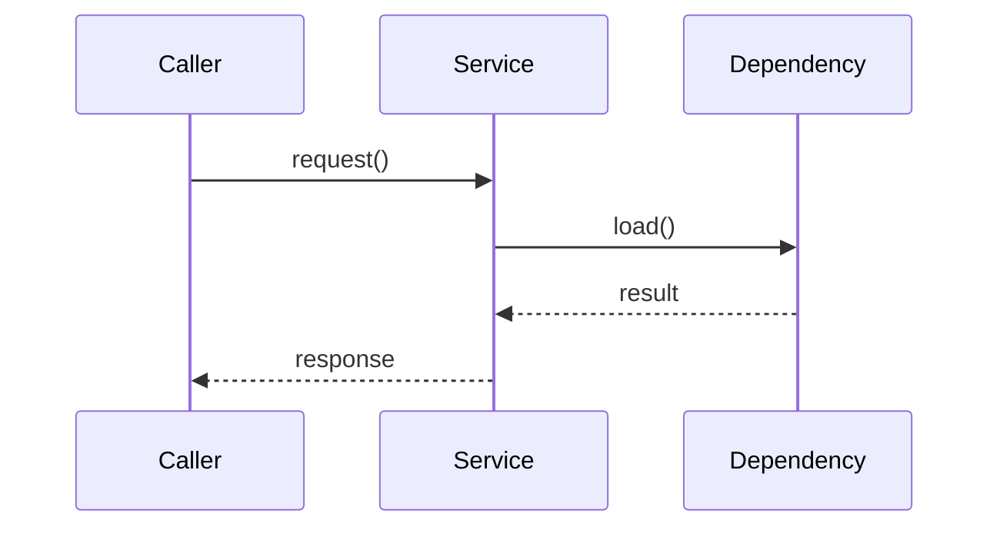

# Rust 设计文档规则

## 目标
- 让 Rust 模块的 `design.md` 在编码前明确类型接口、调用流程和文件布局。
- 避免 implementation 依赖口头说明、隐含模块边界或临时路径推断。
- 让 testing 和 acceptance 能从设计文档直接推导验证面与证据路径。

## 适用范围
- 修改 Rust 工作区 `src/` 内 crate、module、trait、struct、enum、async task、runtime assembly 的 design 工作。
- 涉及 Rust 与配置、Web 控制面、外部服务、系统进程或网络协议交互时，也必须描述 Rust 侧边界。
- 纯文档、纯 Web UI 或非 Rust 配置变更不强制套用本规则，但若 design 涉及 Rust 调用链，应引用本规则。

## 必需输入
- 对应模块的 `proposal.md`
- 通用设计规则：`harness/rules/design-doc-rules.md`
- 相关长期模块文档：`docs/modules/<module>.md`
- 相关 crate 或目录的现有代码路径

## 必备章节
Rust 模块的 `design.md` 除通用设计规则要求外，还必须包含以下内容：

- Rust 类型与接口设计
- 主要流程调用逻辑
- Rust 文件与目录结构
- 错误处理与生命周期边界
- 并发、异步与资源所有权
- 配置、依赖注入与测试替身边界

## Rust 类型与接口设计
- 必须列出新增或关键变更的 `struct`、`enum`、`trait`、`impl`、公开函数和模块级入口。
- 每个接口必须说明职责、输入、输出、错误类型、所有权语义和可见性。
- 对外暴露接口必须标明路径，例如 `crate::runtime::GatewayRuntime`。
- trait 设计必须说明对象安全、泛型约束、生命周期参数和实现归属。
- enum 设计必须说明状态机语义、变体含义和不变量。
- 若不新增类型或接口，必须显式写明“无新增 Rust 类型接口”，并说明复用的现有接口路径。

建议表格：

| 类型 / 接口 | 路径 | 可见性 | 职责 | 输入 | 输出 | 错误 | 所有权 / 生命周期 |
|-------------|------|--------|------|------|------|------|-------------------|
| | | | | | | | |

## 主要流程调用逻辑
- 必须描述关键入口到核心实现再到外部依赖的调用链。
- 对异步流程，必须标明 `async` 边界、spawn 点、取消条件和 shutdown 顺序。
- 对事件驱动或回调流程，必须标明触发源、状态迁移、重试和幂等要求。
- 对跨模块调用，必须标明调用方向和被调用模块的稳定接口。
- 复杂流程应使用 Mermaid sequence diagram 或分步列表；不得只写“调用对应模块处理”。

建议格式：



## Rust 文件与目录结构
- 必须列出相关 crate、module、文件和测试目录的目标结构。
- 新增文件必须说明职责；修改现有文件必须说明变更边界。
- 路径必须从仓库根或 Rust 工作区根开始，避免只写抽象组件名。
- 若使用 `mod.rs`、子模块或 feature gate，必须说明 module 导出关系。
- 若包含测试代码，必须区分 unit、integration、DV 或 harness script 所属路径。

建议格式：

```text
src/
└── components/
    └── cyfs-gateway-lib/
        └── src/
            └── module_name/
                ├── mod.rs
                └── service.rs
```

| 路径 | 新增 / 修改 | 职责 | 导出关系 | 测试归属 |
|------|-------------|------|----------|----------|
| | | | | |

## 错误处理与生命周期边界
- 必须说明错误类型、错误转换、日志等级和向调用方暴露的失败语义。
- runtime、server、listener、connection、background task 必须说明启动、停止、drop 和资源释放顺序。
- 涉及重试、超时或降级时，必须说明默认值、配置来源和失败后的状态。

## 并发、异步与资源所有权
- 必须说明共享状态使用 `Arc`、锁、channel、watch、broadcast 或其他同步原语的原因。
- 必须说明锁顺序、潜在阻塞点和避免死锁的策略。
- `tokio::spawn`、任务集合、long-running loop 必须说明退出信号和 join / abort 策略。
- 涉及 socket、file、cert、token、cache 等资源时，必须说明所有者和清理路径。

## 配置、依赖注入与测试替身边界
- 必须说明配置对象如何进入 Rust 类型，以及默认值、校验和兼容策略。
- 外部依赖必须说明真实实现和测试替身的切换边界。
- 若设计依赖 feature flag、环境变量或 rootfs 配置模板，必须列出具体路径。

## 评审问题
- 是否能从设计文档直接找到要新增或修改的 Rust 类型接口？
- 是否能从设计文档复盘主要调用流程，而不需要阅读聊天上下文？
- 是否能从文件布局判断 implementation 应修改哪些文件、不能修改哪些文件？
- 是否明确了 async shutdown、错误传播和资源所有权？
- testing 文档是否能基于接口和调用流程映射具体测试证据？
